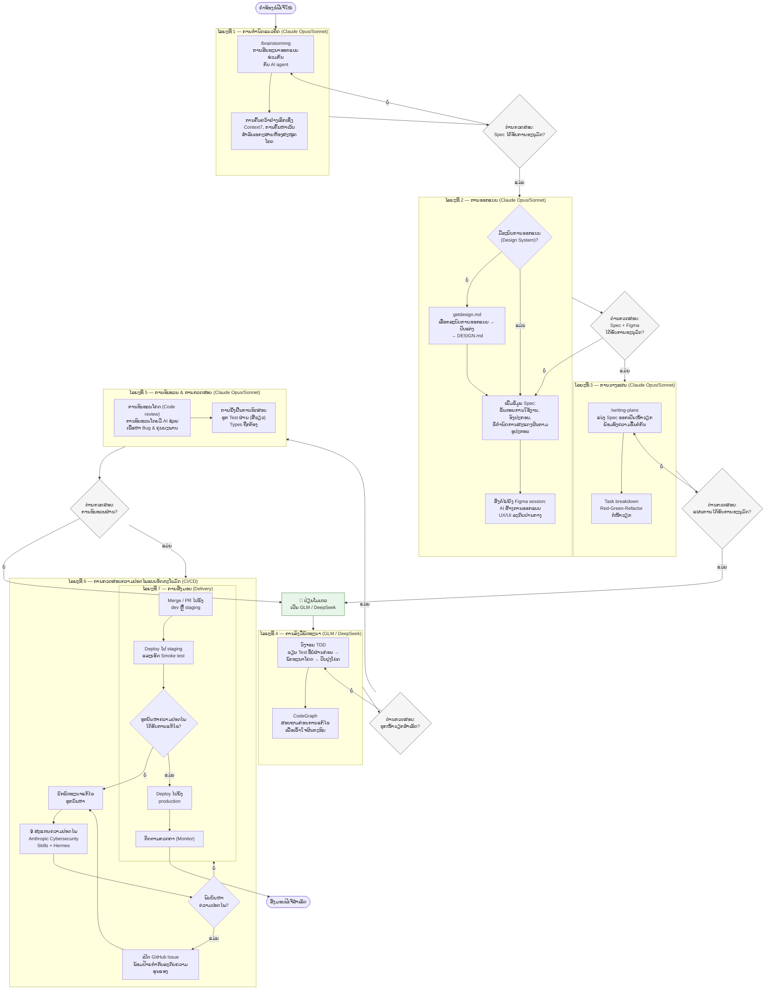
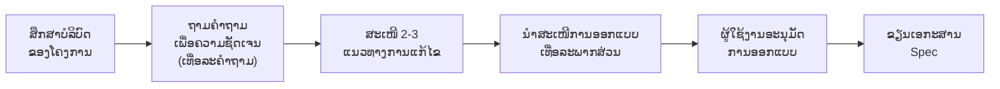
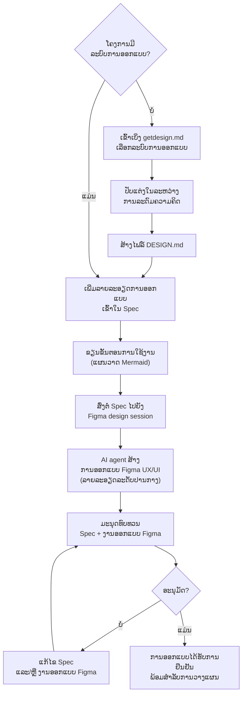
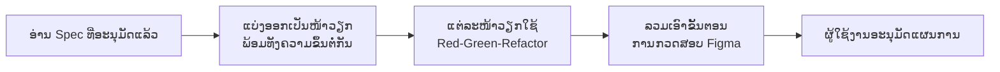
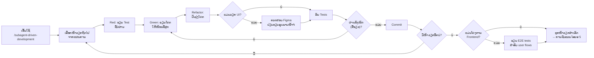
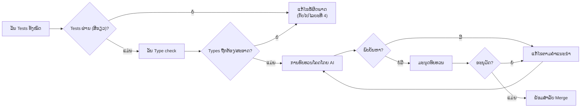
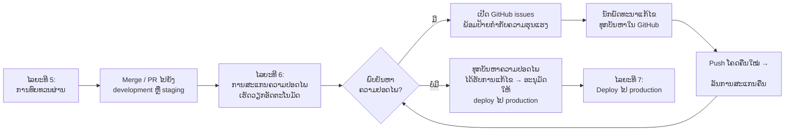
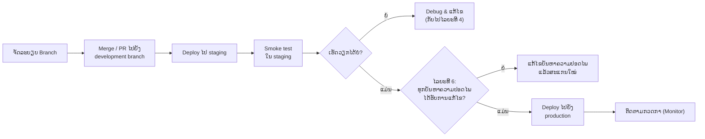
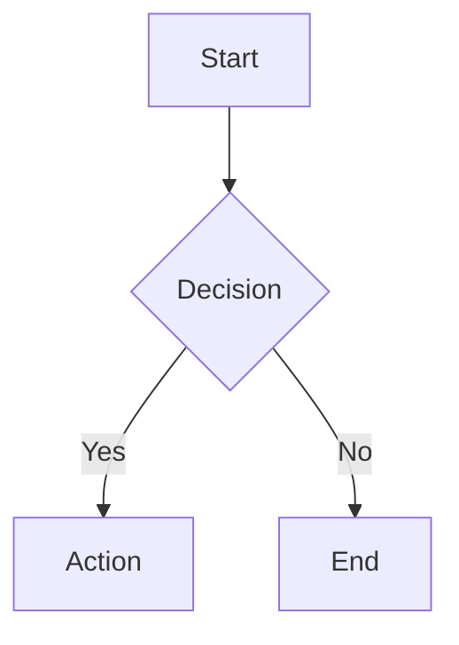

[English](README.md) | [ພາສາລາວ](README.la.md)

# ຂັ້ນຕອນການເຮັດວຽກຂອງເອໄອເອເຈນ (AI Agent) — ເອກະສານຂະບວນການພາຍໃນ

**ສະຖານະ:** ອັບເດດແລ້ວ
**ວັນທີ:** 2026-06-01
**ຜູ້ຮັບຜິດຊອບ:** ທີມງານວິສະວະກຳ (Engineering Team)
**ຂອບເຂດ:** ເອກະສານອ້າງອີງທົ່ວທັງອົງກອນສຳລັບການພັດທະນາທີ່ຊ່ວຍເຫຼືອໂດຍ AI

---

<!-- markdownlint-disable MD024 -->

## ສາລະບານ

1. [ພາບລວມ & ຫຼັກການ](#1-ພາບລວມ--ຫຼັກການ)
2. [ແຜນວາດວົງຈອນຊີວິດ](#2-ແຜນວາດວົງຈອນຊີວິດ-lifecycle-diagram)
3. [ໄລຍະທີ 1 — ການກຳນົດແນວຄິດ (Ideation)](#3-ໄລຍະທີ-1--ການກຳນົດແນວຄິດ-ideation)
4. [ໄລຍະທີ 2 — ການອອກແບບ (Design)](#4-ໄລຍະທີ-2--ການອອກແບບ-design)
5. [ໄລຍະທີ 3 — ການວາງແຜນ (Planning)](#5-ໄລຍະທີ-3--ການວາງແຜນ-planning)
6. [ໄລຍະທີ 4 — ການລົງມືພັດທະນາ (Implementation)](#6-ໄລຍະທີ-4--ການລົງມືພັດທະນາ-implementation)
7. [ໄລຍະທີ 5 — ການทົບທວນ & ການກວດສອບ (Review & Verification)](#7-ໄລຍະທີ-5--ການທົບທວນ--ການກວດສອບ-review--verification)
8. [ໄລຍະທີ 6 — ການກວດສອບຄວາມປອດໄພແບບອັດຕະໂນມັດ (Automated Security Review)](#8-ໄລຍະທີ-6--ການກວດສອບຄວາມປອດໄພແບບອັດຕະໂນມັດ-automated-security-review)
9. [ໄລຍະທີ 7 — ການສົ່ງມອບ (Delivery)](#9-ໄລຍະທີ-7--ການສົ່ງມອບ-delivery)
10. [ຄູ່ມືເຄື່ອງມືອ້າງອີງ (Tool Reference Catalog)](#10-ຄູ່ມືເຄື່ອງມືອ້າງອີງ-tool-reference-catalog)
11. [ກົນລະຍຸດການນຳໃຊ້ຫຼາຍໂມເດວ (Multi-Model Strategy)](#11-ກົນລະຍຸດການນຳໃຊ້ຫຼາຍໂມເດວ-multi-model-strategy)
12. [ຮູບແບບທີ່ບໍ່ຄວນປະຕິບັດ (Anti-Patterns)](#12-ຮູບແບບທີ່ບໍ່ຄວນປະຕິບັດ-anti-patterns)
13. [ພາກຜະໜວກ ກ — ກໍລະນີສຶກສາ Xangnam-CF](#ພາກຜະໜວກ-ກ--ກໍລະນີສຶກສາ-xangnam-cf)
14. [ພາກຜະໜວກ ຂ — ແມ່ແບບ CLAUDE.md](#ພາກຜະໜວກ-ຂ--ແມ່ແບບ-claudemd)

---

## 1. ພາບລວມ & ຫຼັກການ

### ຈຸດປະສົງຂອງເອກະສານ

ເອໄອເອເຈນສຳລັບການຂຽນໂຄດ (AI coding agents) ແມ່ນຕົວຊ່ວຍທະວີຄູນປະສິດທິພາບ (force multipliers) ສຳລັບການເຮັດວຽກວິສະວະກຳທີ່ມີລະບຽບວິໄນ — ບໍ່ແມ່ນການມາປ່ຽນແທນການຄິດຂອງມະນຸດ. ຫາກປາສະຈາກໂຄງສ້າງ ແລະ ຂັ້ນຕອນທີ່ດີ, AI coding agents ຈະເລັ່ງໃຫ້ເກີດຄວາມຜິດພາດໄດ້ໄວເທົ່າກັບຄວາມໄວໃນການພັດທະນາ. ເອກະສານສະບັບນີ້ກຳນົດຂັ້ນຕອນການເຮັດວຽກ (workflow) ທີ່ສາມາດເຮັດຊ້ຳໄດ້ ເພື່ອຮັບປະກັນວ່າ AI ຈະຊ່ວຍເພີ່ມຄຸນນະພາບ ບໍ່ແມ່ນພຽງແຕ່ເພີ່ມຄວາມໄວເທົ່ານັ້ນ.

ທຸກໆຟີເຈີ (feature), ບໍ່ວ່າຈະມີຂະໜາດໃດກໍຕາມ, ຕ້ອງຜ່ານໄລຍະວົງຈອນຊີວິດ (lifecycle phases) ດຽວກັນທັງໝົດ. AI agents ຈະຊ່ວຍເຫຼືອໃນແຕ່ລະໄລຍະ, ແຕ່ **ການຕັດສິນໃຈຂອງມະນຸດແມ່ນດ່ານກວດສອບ (gate) ໃນທຸກໆການປ່ຽນຜ່ານ** ລະຫວ່າງແຕ່ລະໄລຍະ.

### ຫຼັກການຊີ້ນຳ

1. **ອອກແບບກ່ອນຂຽນໂຄດ (Design before code).** ຫ້າມເລີ່ມຕົ້ນການລົງມືພັດທະນາໂດຍບໍ່ມີເອກະສານຂໍ້ກຳນົດ (spec) ແລະ ແຜນການ (plan) ທີ່ໄດ້ຮັບການອະນຸມັດແລ້ວ. ການອອກແບບ 1 ຊົ່ວໂມງ ຈະຊ່ວຍປະຢັດເວລາໃນການແກ້ໄຂວຽກຄືນໄດ້ເປັນມື້.

2. **ກວດສອບຄວາມຖືກຕ້ອງກ່ອນບອກວ່າສຳເລັດ (Verify before claiming done).** ຕ້ອງມີຫຼັກຖານຢັ້ງຢືນກ່ອນການກ່າວອ້າງ. ການທົດສອບ (tests) ຕ້ອງຜ່ານ, ປະເພດຂໍ້ມູນ (types) ຕ້ອງຖືກຕ້ອງ, ຜົນງານກົງກັບການອອກແບບ — ຖ້າບໍ່ດັ່ງນັ້ນ ຖືວ່າຍັງບໍ່ສຳເລັດ.

3. **ໃຊ້ເຄື່ອງມືໃຫ້ຖືກກັບວຽກ (One tool per job).** ເຄື່ອງມື AI ແຕ່ລະຊະນິດມີຈຸດເດັ່ນທີ່ແຕກຕ່າງກັນ. ຈົ່ງໃຊ້ໃຫ້ຖືກຕ້ອງຕາມຈຸດປະສົງ. ຫ້າມຂໍໃຫ້ Figma MCP ຂຽນ SQL, ແລະ ຫ້າມຂໍໃຫ້ CodeGraph ອອກແບບ UI.

4. **ບໍລິບົດຄືສິ່ງສຳຄັນທີ່ສຸດ (Context is king).** ປ້ອນບໍລິບົດ (context) ທີ່ຖືກຕ້ອງໃຫ້ກັບ agent ກ່ອນທີ່ຈະມອບໝາຍວຽກ. ຄຳແນະນຳຂອງໂຄງການ (`CLAUDE.md`), ໂທເຄັນລະບົບການອອກແບບ (design system tokens), ຂໍ້ກຳນົດທີ່ມີຢູ່ — ສິ່ງເຫຼົ່ານີ້ຄືສິ່ງທີ່ແຍກແຍะລະຫວ່າງ agent ທີ່ມີປະໂຫຍດ ແລະ agent ທີ່ສັບສົນ.

5. **ດ່ານກວດສອບ (Gates) ບໍ່ແມ່ນຂໍ້ແນະນຳ.** ການປ່ຽນຜ່ານລະຫວ່າງແຕ່ລະໄລຍະ (spec → plan → code → review) ແມ່ນຈຸດກວດສອບທີ່ຕ້ອງປະຕິບັດຕາມຢ່າງເຄັ່ງຄັດ. ການຂ້າມດ່ານກວດສອບຈະເຮັດໃຫ້ວຽກທີ່ຕາມມາຫຼັງຈາກນັ້ນບໍ່ມີຄຸນຄ່າ ຫຼື ບໍ່ມີຜົນສັກສິດ.

6. **ໄວ້ວາງໃຈແຕ່ຕ້ອງກວດສອບ (Trust but verify).** ຜົນໄດ້ຮັບຈາກ AI ຖືເປັນພຽງຮ່າງ (draft) ຈົນກວ່າຈະໄດ້ຮັບການຢືນຢັນຈາກມະນຸດ ຫຼື ການທົດສອບແບບອັດຕະໂນມັດ. ທຸກໆຟັງຊັນ (function), ການຍົກຍ້າຍຖານຂໍ້ມູນ (migration) ແລະ ອົງປະກອບ UI (UI component) ທີ່ຖືກສ້າງຂຶ້ນ ຕ້ອງໄດ້ຮັບການກວດສອບຄວາມຖືກຕ້ອງກ່ອນທີ່ຈະສົ່ງມອບ.

7. **ພັດທະນາແບບເທື່ອລະກ້າວດີກວ່າການປ່ຽນແປງຄັ້ງໃຫຍ່ (Incremental over big-bang).** ກ້າວເດີນນ້ອຍໆທີ່ໄດ້ຮັບການກວດສອບແລ້ວ ດີກວ່າການກ້າວກະໂດດຄັ້ງໃຫຍ່ທີ່ບໍ່ໄດ້ຮັບການກວດສອບ. ຈົ່ງ Commit ຫຼັງຈາກສໍາເລັດວຽກແຕ່ລະສ່ວນທີ່ມີເຫດຜົນ (logical unit of work), ບໍ່ແມ່ນ Commit ຫຼັງຈາກການເຮັດວຽກແບບມາຣາທອນ.

8. **ເລືອກໂມເດວໃຫ້ຖືກກັບໄລຍະວຽກ (Right model for the right phase).** ໃຊ້ໂມເດວທີ່ມີຄວາມສາມາດໃນການຄິດຫາເຫດຜົນສູງສຸດ (Claude Opus/Sonnet) ສຳລັບການອອກແບບ, ການວາງແຜນ ແລະ ການທົບທວນ — ເຊິ່ງເປັນສ່ວນທີ່ຕ້ອງໃຊ້ວິຈາລະນາຍານ. ໃຊ້ໂມເດວຂຽນໂຄດທີ່ປະຢັດຄ່າໃຊ້ຈ່າຍ (GLM, DeepSeek) ສຳລັບການລົງມືພັດທະນາ — ເຊິ່ງເປັນສ່ວນທີ່ແຜນການມີຄວາມຊັດເຈນຢູ່ແລ້ວ ແລະ ການເຮັດວຽກເປັນໄປຕາມຂັ້ນຕອນປົກກະຕິ. ຈົ່ງປ່ຽນໂມເດວຢ່າງຕັ້ງໃຈເມື່ອຮອດခອບເຂດການປ່ຽນໄລຍະວຽກ.

---

## 2. ແຜນວາດວົງຈອນຊີວິດ (Lifecycle Diagram)

ແຜນວາດລຸ່ມນີ້ສະແດງເຖິງວົງຈອນຊີວິດຂອງຟີເຈີທີ່ສົມບູນ ພ້ອມທັງຈຸດປະສານງານຂອງ AI agent ແລະ ດ່ານກວດສອບໂດຍມະນຸດ (human gates).



### ພາບລວມໂດຍຫຍໍ້ (At a Glance)

| ໄລຍະ (Phase) | ໂມເດວ (Model) | ສີ່ງທີ່ນຳເຂົ້າ (Input) | ຜົນໄດ້ຮັບ (Output) | ດ່ານກວດສອບ (Gate) |
| --- | --- | --- | --- | --- |
| 1 — ການກຳນົດແນວຄິດ | Opus / Sonnet | ຄຳຮ້ອງຂໍຟີເຈີ | ເອກະສານ Spec | ມະນຸດອະນຸມັດ Spec |
| 2 — ການອອກແບບ | Opus / Sonnet | Spec ທີ່ໄດ້ຮັບການອະນຸມັດ | `DESIGN.md` + ເຟຣມ Figma | ມະນຸດອະນຸມັດ Spec + Figma |
| 3 — ການວາງແຜນ | Sonnet / Opus | ການອອກແບບທີ່ໄດ້ຮັບການອະນຸມັດ | ແຜນການພັດທະນາ | ມະນຸດອະນຸມັດແຜນການ |
| 4 — ການລົງມືພັດທະນາ | GLM / DeepSeek | ແຜນການທີ່ໄດ້ຮັບການອະນຸມັດ | ໂຄດທີ່ Commit ແລະ Test ແລ້ວ | ທຸກໜ້າວຽກຜ່ານການທົດສອບ (ສີຂຽວ) |
| 5 — ການທົບທວນ | Opus / Sonnet | ໂຄດທີ່ Commit ແລ້ວ | ໂຄດທີ່ມີຄຸນນະພາບ ແລະ Type-safe | AI + ມະນຸດ ທົບທວນຜ່ານ |
| 6 — ຄວາມປອດໄພ | CI/CD (ອັດຕະໂນມັດ) | ທຸກໆການ Push ໂຄດ | GitHub issues ຫຼື ຜົນສະແກນປອດໄພ | ແກ້ໄຂທຸກບັນຫາຄວາມປອດໄພແລ້ວ |
| 7 — ການສົ່ງມອບ | ທຸກໂມເດວ | ຜົນສະແກນ ແລະ ການທົບທວນທີ່ຜ່ານ | ຟີເຈີທີ່ໃຊ້ງານຈິງໃນ Production | — |

---

## 3. ໄລຍະທີ 1 — ການກຳນົດແນວຄິດ (Ideation)

**ນຳໃຊ້ກັບທຸກໆຟີເຈີໃໝ່, ອົງປະກອບ (component), ຫຼື ການປ່ຽນແປງທີ່ສຳຄັນ — ໂດຍບໍ່ມີການຍົກເວັ້ນ.** ປ່ຽນແນວຄິດດິບໃຫ້ກາຍເປັນເອກະສານຂໍ້ກຳນົດ (spec) ທີ່ໄດ້ຮັບການກວດສອບຄວາມຖືກຕ້ອງ ຜ່ານການສົນທະນາຮ່ວມມືກັນ ກ່ອນທີ່ຈະມີການຂຽນໂຄດໃດໆ. ເຖິງແມ່ນວ່າຟີເຈີທີ່ "ງ່າຍດາຍ" ກໍຍັງໄດ້ຮັບຜົນປະໂຫຍດຈາກຂັ້ນຕອນນີ້; ເນື່ອງຈາກຂໍ້ສົມມຸດຕິຖານທີ່ບໍ່ໄດ້ຮັບການກວດສອບໃນໂຄງການຂະໜາດນ້ອຍ ມັກຈະເປັນສາເຫດຫຼັກທີ່ເຮັດໃຫ້ເສຍເວລາເຮັດວຽກຫຼາຍທີ່ສຸດ.

### ຂັ້ນຕອນການເຮັດວຽກ



### ຂັ້ນຕອນລະອຽດ

1. **ສຶກສາບໍລິບົດຂອງໂຄງການ (Explore project context).** AI agent ຈະອ່ານໄຟລ໌ທີ່ມີຢູ່, ເອກະສານ, commit ຫຼ້າສຸດ ແລະ ຄຳແນະນຳຂອງໂຄງການ ເພື່ອເຂົ້າໃຈວ່າຟີເຈີໃໝ່ນີ້ຈະເໝາະສົມກັບສ່ວນໃດຂອງໂຄງການ.

2. **ຖາມຄຳຖາມເພື່ອຄວາມຊັດເຈນ (Clarifying questions).** Agent ຈະຖາມເທື່ອລະຄຳຖາມເພື່ອເຮັດຄວາມເຂົ້າໃຈກັບຈຸດປະສົງ, ກຸ່ມຜູ້ໃຊ້ງານ, ຂໍ້ຈຳກັດ ແລະ ເກນການວັດຜົນຄວາມສຳເລັດ. ຄວນຖາມແບບມີຕົວເລືອກ (multiple-choice) ຫຼາຍກວ່າຄຳຖາມປາຍເປີດ. ຄຳຕອບຂອງມະນຸດຈະເປັນຕົວຊ່ວຍກຳນົດຂອບເຂດຂອງວຽກ.

3. **ສະເໜີແນວທາງການແກ້ໄຂ (Propose approaches).** Agent ຈະນຳສະເໜີ 2-3 ແນວທາງທີ່ແຕກຕ່າງກັນ ພ້ອມທັງຂໍ້ດີຂໍ້ເສຍ ແລະ ຂໍ້ສະເໜີແນະນຳທີ່ຊັດເຈນ. ຈາກນັ້ນ ມະນຸດຈະເປັນຜູ້ເລືອກ ຫຼື ປະສົມປະສານແນວທາງເຫຼົ່ານັ້ນ.

4. **ນຳສະເໜີການອອກແບບ (Present design).** Agent ຈະນຳສະເໜີການອອກແບບເທື່ອລະພາກສ່ວນ (ສະຖາປັດຕະຍະກຳ, ອົງປະກອບ, ການໄຫຼຂອງຂໍ້ມູນ, ການຈັດການຂໍ້ຜິດພາດ, ການທົດສອບ). ມະນຸດຈະເປັນຜູ້ອະນຸມັດ ຫຼື ຮ້ອງຂໍໃຫ້ມີການປ່ຽນແປງຫຼັງຈາກແຕ່ລະພາກສ່ວນ.

5. **ຂຽນເອກະສານ Spec (Write spec).** ການອອກແບບທີ່ໄດ້ຮັບການຢືນຢັນແລ້ວ ຈະຖືກບັນທຶກເປັນເອກະສານ markdown ທີ່ມີໂຄງສ້າງ ໄວນາໂຟນເດີ spec ຂອງໂຄງການ.

### ເຄື່ອງມືທີ່ນຳໃຊ້

| ເຄື່ອງມື (Tool) | ບົດບາດ (Role) |
| --- | --- |
| Claude Code + Superpowers `/brainstorming` skill | ດຳເນີນການສົນທະນາເພື່ອລະດົມຄວາມຄິດ |
| Context7 MCP | ດຶງຂໍ້ມູນເອກະສານຂອງຫ້ອງສະໝຸດໂຄດ/ເຟຣມເວີກໃນປັດຈຸບັນ ເພື່ອໃຫ້ການອອກແບບອ້າງອີງເຖິງ API ຕົວຈິງ |
| ການຄົ້ນຫາເວັບ (Web search) | ຄົ້ນຄວ້າແນວທາງປະຕິບັດທີ່ດີທີ່ສຸດ (best practices), ຮູບແບບ (patterns) ແລະ ແນວທາງຂອງຄູ່ແຂ່ງ |
| CodeGraph | ເຂົ້າໃຈໂຄງສ້າງຂອງ codebase ທີ່ມີຢູ່ ກ່ອນທີ່ຈະສະເໜີການປ່ຽນແປງ |

### ຈຸດທີ່ຕ້ອງຕັດສິນໃຈ

- **ຂອບເຂດວຽກໃຫຍ່ເກີນໄປ? (Scope too large?)** ຫາກຄຳຮ້ອງຂໍອະທິບາຍເຖິງຫຼາຍລະບົບຍ່ອຍທີ່ເປັນອິດສະຫຼະຕໍ່ກັນ (ເຊັ່ນ: "ສ້າງແພລດຟອມທີ່ມີລະບົບແຊັດ, ບ່ອນເກັບໄຟລ໌, ລະບົບຄິດໄລ່ເງິນ ແລະ ລະບົບວິເຄາະຂໍ້ມູນ"), ໃຫ້ແຍກຍ່ອຍອອກເປັນໂຄງການຍ່ອຍ (sub-projects) ກ່ອນ. ແຕ່ລະໂຄງການຍ່ອຍຈະມີວົງຈອນ spec → plan → implementation ເປັນຂອງຕົນເອງ.
- **ຂອບເຂດວຽກນ້ອຍແທ້ໆ? (Scope genuinely small?)** ການອອກແບບອາດຈະສັ້ນ — ພຽງແຕ່ບໍ່ກີ່ປະໂຫຍກ — ແຕ່ກໍຍັງຕ້ອງຜ່ານຂະບວນການນີ້. ຫ້າມຂ້າມຂັ້ນຕອນ.

### ຜົນໄດ້ຮັບ (Output)

ເອກະສານ spec ຈະຖືກບັນທຶກໄວ້ທີ່ `docs/superpowers/specs/YYYY-MM-DD-<topic>-design.md` (ຫຼື ໂຟນເດີ spec ທີ່ທຽບເທົ່າຂອງໂຄງການ), ແລະ Commit ໄປຍັງ git.

---

## 4. ໄລຍະທີ 2 — ການອອກແບບ (Design)

**ນຳໃຊ້ຫຼັງຈາກ Spec ໄດ້ຮັບການອະນຸມັດໃນໄລຍະທີ 1 ແລະ ກ່ອນທີ່ຈະຂຽນແຜນການພັດທະນາ (implementation plan).** ປ່ຽນ Spec ໃຫ້ເປັນຊຸດການອອກແບບທີ່ສົມບູນ: Spec ທີ່ເພີ່ມລາຍລະອຽດຂັ້ນຕອນການໃຊ້ງານ (user flows) ແລະ ຂໍ້ກຳນົດການສະແດງຜົນຕາມອຸປະກອນ (responsive specifications), ພ້ອມທັງການອອກແບບ Figma UX/UI ລະດັບປານກາງສຳລັບການທົບທວນດ້ານສາຍຕາ. **ດ່ານທຳອິດ:** ຫາກໂຄງການບໍ່ມີລະບົບການອອກແບບ (design system), ຕ້ອງສ້າງຂຶ້ນມາກ່ອນທີ່ຈະເລີ່ມຕົ້ນວຽກອອກແບບອື່ນໆ.

### ຂັ້ນຕອນການເຮັດວຽກ



### ຂັ້ນຕອນລະອຽດ

1. **ດ່ານກວດສອບລະບົບການອອກແບບ (ຂັ້ນຕອນບັງຄັບທຳອິດ).** ກ່ອນທີ່ວຽກອອກແບບໃດໆຈະເລີ່ມຕົ້ນ, ໃຫ້ກວດສອບວ່າໂຄງການມີເອກະສານລະບົບການອອກແບບ (`design-system.md` ຫຼື `DESIGN.md`) ແລ້ວຫຼືບໍ່. ຫາກບໍ່ມີ:
   - ເຂົ້າເບິ່ງ [getdesign.md](https://getdesign.md/) ເພື່ອຊອກຫາລະບົບການອອກແບບທີ່ກົງກັບຍີ່ຫໍ້ (brand) ແລະ ຄວາມງາມ (aesthetic) ຂອງໂຄງການ.
   - ເລືອກລະບົບການອອກແບບເພື່ອເປັນຈຸດເລີ່ມຕົ້ນ (ເຊັ່ນ: Cal.com ສຳລັບແບບສະອາດຕາ/ເນັ້ນນັກພັດທະນາ, Stripe ສຳລັບແບບພຣີມ່ຽມ/ຟິນເທັກ, Linear ສຳລັບແບບມິນິມອນສຸດໆ).
   - ປັບແຕ່ງມັນໃນລະຫວ່າງການລະດົມຄວາມຄິດ — ປັບປ່ຽນສີ, ຮູບແບບຕົວອັກສອນ (typography), ໄລຍະຫ່າງ (spacing) ແລະ ກົດເກນຂອງອົງປະກອບໃຫ້ເໝາະສົມກັບໂຄງການ.
   - ບັນທຶກຜົນໄດ້ຮັບທີ່ປັບແຕ່ງແລ້ວນັ້ນໄວ້ເປັນ `docs/DESIGN.md` (ຫຼື `docs/design-system.md`).
   - ໄຟລ໌ນີ້ຈະກາຍເປັນແຫຼ່ງຂໍ້ມູນອ້າງອີງດຽວທີ່ຖືກຕ້ອງທີ່ສຸດ (single source of truth) ສຳລັບ design tokens ທັງໝົດ. ຫ້າມດຳເນີນວຽກ UI ໃດໆ ຫາກບໍ່ມີໄຟລ໌ນີ້.

2. **ເພີ່ມລາຍລະອຽດການອອກແບບເຂົ້າໃນ Spec (Enrich spec with design details).** Spec ຈາກໄລຍະທີ 1 ຈະລະບຸວ່າ *ແມ່ນຫຍັງ* ແລະ *ເປັນຫຍັງ*. ສ່ວນໄລຍະທີ 2 ຈະຕື່ມຂໍ້ມູນລາຍລະອຽດດ້ານພາບ ແລະ ໂຄງສ້າງ ເພື່ອໃຫ້ການລົງມືພັດທະນາບໍ່ມີຄວາມກຳກວມ:
   - **ສະຖາປັດຕະຍະກຳ (Architecture)** — ໂຄງສ້າງ Component tree, ໂຄງສ້າງໜ້າເວັບ, ຄວາມກ່ຽວພັນກັນລະຫວ່າງແຕ່ລະພາກສ່ວນ
   - **ການໄຫຼຂອງຂໍ້ມູນ (Data flow)** — ແຜນວາດ Mermaid ສະແດງໃຫ້ເຫັນວິທີການເຄື່ອນຍ້າຍຂອງຂໍ້ມູນຜ່ານຟີເຈີ
   - **ອົງປະກອບ (Components)** — ເລືອກໃຊ້ອົງປະກອບໃດຂອງລະບົບການອອກແບບ (ປຸ່ມ Button, ກາດ Card, ປ້າຍ Badge ແລະ ອື່ນໆ)
   - **การສະແດງຜົນຕາມອຸປະກອນ (Responsive)** — ໂຄງຮ່າງໜ້າເວັບ (layout) ໃນມືຖື (<768px), ແທັບເລັດ (768-1024px) ແລະ ເດັສທັອບ (≥1024px). ຈຳນວນຖັນ Grid, ການຂະຫຍາຍຂະໜາດຕົວອັກສອນ, ການຈັດວາງປຸ່ມ CTA ແລະ ຮູບແບບການນຳທາງ (navigation patterns) ຕ້ອງຖືກກຳນົດຢ່າງຊັດເຈນ.

3. **ຂຽນຂັ້ນຕອນການໃຊ້ງານ (Write user flows).** ສຳລັບທຸກໆຟີເຈີທີ່ພົວພັນກັບຜູ້ໃຊ້ງານ, ໃຫ້ສ້າງແຜນວາດຂັ້ນຕອນການໃຊ້ງານ (user flow diagram) ໃນຮູບແບບ Mermaid ທີ່ສະແດງເສັ້ນທາງທັງໝົດທີ່ຜູ້ໃຊ້ງານດຳເນີນການຜ່ານຟີເຈີ. ປະກອບມີ:
   - ຈຸດເລີ່ມຕົ້ນ (Entry points) (ຜູ້ໃຊ້ງານມາຈາກໃສ?)
   - ຈຸດຕັດສິນໃຈ (Decision points) (ຜູ້ໃຊ້ງານມີທາງເລືອກໃດແດ່?)
   - ເສັ້ນທາງປົກກະຕິ (Happy path) ແລະ ສະຖານະຜິດພາດ/ສະຖານະຫວ່າງເປົ່າ (error/empty states)
   - ຈຸດອອກ (Exit points) (ຜູ້ໃຊ້ງານຈະໄປໃສຕໍ່?)
   - ແຕ່ລະໜ້າຈໍ/ສະຖານະໃນ flow ຕ້ອງກົງກັບເຟຣມໃນ Figma

4. **ສົ່ງຕໍ່ Spec ໄປຍັງ Figma design session.** ເປີດ **AI agent session ແຍກຕ່າງຫາກ** (ບໍ່ແມ່ນ session ທີ່ໃຊ້ລະດົມຄວາມຄິດ) ແລະ ປ້ອນຂໍ້ມູນຕໍ່ໄປນີ້ໃຫ້ກັບມັນ:
   - ເອກະສານ Spec ທີ່ໄດ້ເພີ່ມລາຍລະອຽດແລ້ວ
   - ແຜນວາດຂັ້ນຕອນການໃຊ້ງານ (user flow diagrams)
   - ໄຟລ໌ `DESIGN.md` / ໂທເຄັນລະບົບການອອກແບບ (design system tokens)
   - ຄີໄຟລ໌ Figma (Figma file key) (ສ້າງໃໝ່ຫາກຈຳເປັນ)
   - ຄຳແນະນຳໃນການອອກແບບແຕ່ລະໜ້າຈໍຈາກ user flow ໃຫ້ເປັນເຟຣມ Figma

5. **AI agent ສ້າງການອອກແບບ Figma UX/UI.** Agent ໃນ Figma session ຈະໃຊ້ Figma MCP (`use_figma`) ເພື່ອສ້າງການອອກແບບ. ລະດັບລາຍລະອຽດແມ່ນ **ລະດັບປານກາງ (mid-level)** — ມີໂຄງສ້າງ ແລະ ຄວາມຊັດເຈນພຽງພໍສຳລັບການລົງມືພັດທະນາ ແຕ່ບໍ່ຮອດຂັ້ນມີລາຍລະອຽດທຸກຢ່າງປານີດຈົນເກີນໄປ:

   **ສິ່ງທີ່ການອອກແບບ Figma ລະດັບປານກາງປະກອບມີ:**
   - ໂຄງຮ່າງໜ້າເວັບ (layouts) ທີ່ມີໄລຍະຫ່າງ (spacing), ການຍັບຍໍ້ (padding) ແລະ ໂຄງສ້າງພາກສ່ວນທີ່ຖືກຕ້ອງ
   - ການຈັດວາງອົງປະກອບຈິງ (ປຸ່ມ, ກາດ, ຟອມ, ແຖບນຳທາງ) ໂດຍໃຊ້ design system tokens
   - ລຳດັບຂັ້ນຂອງຕົວອັກສອນ (typography hierarchy) (ຂະໜາດຫົວຂໍ້, ຂໍ້ຄວາມຫຼັກ, ປ້າຍກຳນົດ) ທີ່ກົງກັບ `DESIGN.md`
   - ການນຳໃຊ້ສີໂດຍໃຊ້ຕົວປ່ຽນລະບົບການອອກແບບ (ສີຫຼັກ, ສີເນັ້ນ, ສີພື້ນຜິວ)
   - ຕົວເລືອກຕາມອຸປະກອນ (Responsive variants): layouts ສຳລັບມືຖື ແລະ ເດັສທັອບ ສຳລັບໜ້າຈໍຫຼັກ
   - ຄຳແນະນຳສະຖານະໂຕ້ຕອບ (interactive state hints) (hover, active, disabled — ບັນທຶກໄວ້ແຕ່ບໍ່ໄດ້ລະອຽດທັງໝົດ)
   - ສະຖານະຫວ່າງເປົ່າ (empty states), ສະຖານະຜິດພາດ (error states) ແລະ ສະຖານະກຳລັງໂຫຼດ (loading states) ສຳລັບໜ້າຈໍຫຼັກ

   **ສິ່ງທີ່ການອອກແບບ Figma ລະດັບປານກາງ ບໍ່ໄດ້ລວມເອົາ (ຢູ່ນອກຂອບເຂດ):**
   - ແອນິເມຊັນໂຕ້ຕອບຂະໜາດນ້ອຍ (micro-interactions) (ການປ່ຽນຜ່ານເວລາ hover, ເອັບເຟັກເວລາເລື່ອນ scroll)
   - ການກຳນົດຂະໜາດໄອຄອນໃຫ້ລະອຽດລະດັບພິກເຊວສຳລັບທຸກໆສະຖານະທີ່ເປັນໄປໄດ້
   - ຕາຕະລາງລວມຕົວປ່ຽນທັງໝົດ (ເຊັ່ນ: ທຸກໆປຸ່ມ × ສີ × ຂະໜາດ)
   - ຕົວເລືອກໂໝດມືດ (dark mode variants) (ຍົກເວັ້ນແຕ່ໄດ້ຮັບການຮ້ອງຂໍເປັນພິເສດ)

6. **ມະນຸດທົບທວນທັງ Spec ແລະ ງານອອກແບບ Figma.** ດ່ານການອະນຸມັດຕ້ອງການການທົບທວນ **ສອງຜົນງານ (artifacts)**:
   - **ການທົບທວນ Spec** — ອ່ານເອກະສານ Spec ທີ່ໄດ້ເພີ່ມລາຍລະອຽດແລ້ວ. ກວດສອບວ່າຂັ້ນຕອນການໃຊ້ງານ (user flows) ສົມບູນ, ຂໍ້ກຳນົດ responsive ຊັດເຈນ ແລະ ການເລືອກໃຊ້ອົງປະກອບມີຄວາມເໝາະສົມ.
   - **ການທົບທວນດ້ານພາບໃນ Figma** — ເປີດ Figma ແລະ ເບິ່ງແຕ່ລະເຟຣມ. ກວດສອບວ່າ layouts ຕົມກັບຄວາມຄາດຫວັງ, ໄລຍະຫ່າງເໝາະສົມ, ຕົວອັກສອນອ່ານງ່າຍ ແລະ ທິດທາງດ້ານພາບໂດຍລວມຖືກຕ້ອງ.
   - **ທັງສອງຢ່າງຕ້ອງຜ່ານ.** ຫາກ Spec ດີແລ້ວແຕ່ການອອກແບບ Figma ຍັງບໍ່ຖືກຕ້ອງ, ໃຫ້ແກ້ໄຂ Figma. ຫາກ Figma looks good ແຕ່ Spec ຍັງຂາດລາຍລະອຽດ, ໃຫ້ກັບໄປແກ້ໄຂ Spec.

7. **ການກວດສອບຫຼັງການພັດທະນາ (ໄລຍະທີ 4).** ຫຼັງຈາກຂຽນໂຄດແລ້ວ, ໃຫ້ດຶງຮູບພາບໜ້າຈໍ Figma ອີກຄັ້ງ ແລະ ປຽບທຽບກັບໜ້າເວັບທີ່ສະແດງຜົນຈິງ. ຂັ້ນຕອນນີ້ຈະເກີດຂຶ້ນໃນໄລຍະທີ 4 ບໍ່ແມ່ນໃນໄລຍະນີ້ — ແຕ່ເຟຣມ Figma ທີ່ສ້າງຂຶ້ນໃນໄລຍະນີ້ຈະເປັນແຫຼ່ງອ້າງອີງສຳລັບການປຽບທຽບນັ້ນ.

### ເຄື່ອງມືທີ່ນຳໃຊ້

| ເຄື່ອງມື (Tool) | ບົດບາດ (Role) |
| --- | --- |
| [getdesign.md](https://getdesign.md/) | ຄັງໄຟລ໌ DESIGN.md ລະດັບໃຊ້ງານຈິງ. ເຂົ້າເບິ່ງ, ເລືອກລະບົບການອອກແບບ, ປັບແຕ່ງສຳລັບໂຄງການ. ຈຳເປັນຕ້ອງໃຊ້ເມື່ອບໍ່ມີລະບົບການອອກແບບ. |
| Figma MCP (`use_figma`) | ສ້າງການອອກແບບ UX/UI ດ້ວຍໂປຣແກຣມໃນ Figma. ນຳໃຊ້ໂດຍ design session agent ເພື່ອສ້າງເຟຣມຈາກ Spec. |
| Figma MCP (`get_design_context`) | ດຶງຂໍ້ມູນ metadata ການອອກແບບ, ການອ້າງອີງໂຄດ ແລະ ຮູບພາບໜ້າຈໍສຳລັບ Figma node. ນຳໃຊ້ໃນລະຫວ່າງການທົບທວນ. |
| Figma MCP (`get_screenshot`) | ບັນທຶກພາບສະຖານະການສະແດງຜົນ ເພື່ອປຽບທຽບໃນລະຫວ່າງການກວດສອບຫຼັງການພັດທະນາ. |
| ເອກະສານລະບົບການອອກແບບ (`DESIGN.md` ຫຼື `design-system.md`) | ແຫຼ່ງຂໍ້ມູນອ້າງອີງດຽວທີ່ຖືກຕ້ອງທີ່ສຸດສຳລັບ tokens ແລະ ອົງປະກອບ. ຖືກປ້ອນໃຫ້ກັບ Figma design agent. |

### ຈຸດທີ່ຕ້ອງຕັດສິນໃຈ

- **ບໍ່ມີລະບົບການອອກແບບ? (No design system exists?)** ນີ້ແມ່ນດ່ານທີ່ປິດກັ້ນການເຮັດວຽກ. ຕ້ອງເຂົ້າໄປເບິ່ງ getdesign.md, ເລືອກການອອກແບບ, ປັບແຕ່ງ ແລະ ສ້າງໄຟລ໌ `DESIGN.md` ກ່ອນທີ່ຈະດຳເນີນການຕໍ່. ບໍ່ມີການຍົກເວັ້ນ.
- **ຍັງບໍ່ມີໄຟລ໌ Figma ເທື່ອ? (No Figma file exists yet?)** ໃຫ້ສ້າງຂຶ້ນມາກ່ອນທີ່ຈະເລີ່ມ Figma design session. Agent ຕ້ອງການຄີໄຟລ໌ (file key) ເພື່ອຂຽນເຟຣມລົງໄປ.
- **ງານອອກແບບບໍ່ກົງກັບ tokens? (Design doesn't match tokens?)** ໃຫ້ອັບເດດງານອອກແບບ Figma ໃຫ້ໃຊ້ tokens ທີ່ຖືກຕ້ອງ ຫຼື (ໃນກໍລະນີໜ້ອຍ) ສະເໜີ token ໃໝ່. ຫ້າມຂ້າມຜ່ານລະບົບ token ໂດຍເດັດຂາດ.
- **ງານອອກແບບ Figma ມີລາຍລະອຽດຕ່ຳເກີນໄປ? (Figma design too low detail?)** ຫາກເຟຣມເບິ່ງຄືຮ່າງແຜນຜັງ (wireframes) ທີ່ບໍ່ມີໄລຍະຫ່າງ/ຮູບແບບຕົວອັກສອນຈິງ, ໃຫ້ລັນ Figma design session ໃໝ່ ໂດຍໃຫ້ຄຳແນະນຳທີ່ຊັດເຈນກວ່າເກົ່າ.
- **ງານອອກແບບ Figma ມີລາຍລະອຽດສູງເກີນໄປ? (Figma design too high detail?)** ຫາກ agent ເສຍເວລາກັບແອນິເມຊັນໂຕ້ຕອບຂະໜາດນ້ອຍ ຫຼື ຕົວປ່ຽນທີ່ລະອຽດເກີນໄປ, ໃຫ້ຈຳກັດຂອບເຂດກັບມາຢູ່ລະດັບปານກາງ. ລາຍລະອຽດເຫຼົ່ານັ້ນຄວນໄປຈັດການໃນຂັ້ນຕອນການພັດທະນາ (implementation).

### ຜົນໄດ້ຮັບ (Output)

1. ໄຟລ໌ `DESIGN.md` (ຫາກຍັງບໍ່ມີມາກ່ອນ)
2. Spec ທີ່ເພີ່ມລາຍລະອຽດພ້ອມແຜນວາດ user flow ແລະ ຂໍ້ກຳນົດ responsive
3. ໄຟລ໌ Figma ທີ່ມີງານອອກແບບ UX/UI ລະດັບປານກາງສຳລັບທຸກໆໜ້າຈໍໃນ user flow
4. ການອະນຸມັດຈາກມະນຸດສຳລັບ **ທັງສອງຢ່າງ** ຄື: ເອກະສານ Spec ແລະ ງານອອກແບບດ້ານພາບໃນ Figma

---

## 5. ໄລຍະທີ 3 — ການວາງແຜນ (Planning)

**ນຳໃຊ້ຫຼັງຈາກ Spec ແລະ ງານອອກແບບ Figma ໄດ້ຮັບການອະນຸມັດໃນໄລຍະທີ 2.** ແບ່ງ Spec ທີ່ໄດ້ຮັບການອະນຸມັດແລ້ວ ອອກເປັນລຳດັບໜ້າວຽກພັດທະນາທີ່ມີການຈັດລຽງຢ່າງເປັນລະບົບ — ແຕ່ລະໜ້າວຽກຕ້ອງມີຂະໜາດນ້ອຍພໍທີ່ຈະເຮັດສຳເລັດໄດ້ໃນຄັ້ງດຽວ, ສາມາດກວດສອບຄວາມຖືກຕ້ອງໄດ້ເປັນອິດສະຫຼະ ແລະ ປະຕິບັດຕາມວົງຈອນ Red-Green-Refactor ຢ່າງຊັດເຈນ.

### ຂັ້ນຕອນການເຮັດວຽກ



### ຂັ້ນຕອນລະອຽດ

1. **ອ່ານ Spec (Read the spec).** AI agent ຈະອ່ານເອກະສານ Spec ທີ່ໄດ້ຮັບການອະນຸມັດແລ້ວທັງໝົດ.

2. **ການແຍກຍ່ອຍໜ້າວຽກ (Task breakdown).** Agent ຈະແຍກຍ່ອຍ Spec ອອກເປັນໜ້າວຽກສະເພາະ. ແຕ່ລະໜ້າວຽກຕ້ອງ:
   - **ມີຂະໜາດນ້ອຍພໍທີ່ຈະເຮັດສຳເລັດໃນຄັ້ງດຽວ** — ຫາກໜ້າວຽກໃດໜຶ່ງໃຊ້ເວລາຫຼາຍກວ່າບໍ່ກີ່ຊົ່ວໂມງ, ໃຫ້ແບ່ງຍ່ອຍມັນອອກ
   - **ສາມາດກວດສອບໄດ້ຢ່າງເປັນອິດສະຫຼະ** — ແຕ່ລະໜ້າວຽກມີສະຖານະ "ສຳເລັດ (done)" ທີ່ຊັດເຈນ
   - **ຈັດລຽງຕາມຄວາມຂຶ້ນຕໍ່ກັນ (dependency)** — ໃຫ້ເຮັດໜ້າວຽກພື້ນຖານກ່ອນໜ້າວຽກທີ່ຕ້ອງເພິ່ງພາພາກສ່ວນອື່ນ

3. **Red-Green-Refactor ຕໍ່ໜ້າວຽກ.** ທຸກໆໜ້າວຽກພັດທະນາຕ້ອງປະກອບມີ 3 ຂັ້ນຕອນຍ່ອຍທີ່ຊັດເຈນ:
   - **Red (ແດງ)** — ຂຽນ Test ທີ່ບໍ່ຜ່ານກ່ອນ. ຫ້າມຂຽນໂຄດພັດທະນາຈົນກວ່າ Test ຈະຖືກສ້າງຂຶ້ນ ແລະ ທົດສອບບໍ່ຜ່ານດ້ວຍເຫດຜົນທີ່ຖືກຕ້ອງ.
   - **Green (ຂຽວ)** — ຂຽນໂຄດພັດທະນາໃຫ້ໜ້ອຍທີ່ສຸດເພື່ອໃຫ້ Test ຜ່ານ.
   - **Refactor (ປັບປຸງ)** — ປັບປຸງໂຄດໃຫ້ສະອາດ ແລະ ເປັນລະບົບໂດຍບໍ່ເຮັດໃຫ້ Test ບໍ່ຜ່ານ.

4. **ຂັ້ນຕອນການກວດສອບ Figma (Figma verification steps).** ສຳລັບໜ້າວຽກໃດໜຶ່ງທີ່ກ່ຽວຂ້ອງກັບ UI, ໃຫ້ລວມເອົາຂັ້ນຕອນກ່ອນການພັດທະນາ (ດຶງບໍລິບົດ Figma) ແລະ ຫຼັງການພັດທະນາ (ປຽບທຽບຮູບພາບໜ້າຈໍ).

5. **ການອະນຸມັດຈາກຜູ້ໃຊ້ງານ (User approval).** ນຳສະເໜີແຜນການໃຫ້ມະນຸດທົບທວນ. ຫ້າມເລີ່ມຕົ້ນການພັດທະນາຈົນກວ່າແຜນການຈະໄດ້ຮັບການອະນຸມັດ.

### ເຄື່ອງມືທີ່ນຳໃຊ້

| ເຄື່ອງມື (Tool) | ບົດບາດ (Role) |
| --- | --- |
| Claude Code + Superpowers `/writing-plans` skill | ຈັດໂຄງສ້າງແຜນການ ພ້ອມທັງໄລຍະວຽກ, ໜ້າວຽກ ແລະ ຄວາມຂຶ້ນຕໍ່ກັນ |
| CodeGraph | ລະບຸໄຟລ໌ ແລະ ສັນຍະລັກ (symbols) ທີ່ຈະໄດ້ຮັບຜົນກະທົບ, ຊ່ວຍປະເມີນຜົນກະທົບ |
| ການຈັດການໜ້າວຽກ (TaskCreate/TaskUpdate) | ຕິດຕາມຄວາມຄືບໜ້າຂອງແຜນການ |

### ຈຸດທີ່ຕ້ອງຕັດສິນໃຈ

- **ໜ້າວຽກມີຂອບເຂດທີ່ບໍ່ຊັດເຈນ? (Task has unclear scope?)** ໃຫ້ແບ່ງຍ່ອຍອອກ. ໜ້າວຽກທີ່ຄຸມເຄືອຈະນຳໄປສູ່ການພັດທະນາທີ່ຄຸມເຄືອ.
- **ໜ້າວຽກບໍ່ມີຊ່ອງທາງໃນການທົດສອບ? (Task has no test path?)** ນີ້ແມ່ນສັນຍານເຕືອນອັນຕະລາຍ. ຫາກທ່ານບໍ່ສາມາດທົດສອບມັນໄດ້, ທ່ານກໍບໍ່ສາມາດກວດສອບຄວາມຖືກຕ້ອງໄດ້. ໃຫ້ທົບທວນ ແລະ ຄິດຫາໜ້າວຽກນັ້ນໃໝ່.
- **ສາມາດເຮັດໜ້າວຽກແບບຂະໜານກັນໄດ້ບໍ? (Parallel tasks possible?)** ໃຫ້ໝາຍໜ້າວຽກທີ່ເປັນອິດສະຫຼະຕໍ່ກັນເພື່ອດຳເນີນການແບບຂະໜານກັນ ໂດຍໃຊ້ subagents ຫຼື worktrees.

### ຜົນໄດ້ຮັບ (Output)

ເອກະສານແຜນການຈະຖືກບັນທຶກໄວ້ທີ່ `docs/superpowers/plans/YYYY-MM-DD-<topic>-implementation.md` (ຫຼື ໂຟນເດີແຜນການທີ່ທຽບເທົ່າຂອງໂຄງການ), ແລະ Commit ໄປຍັງ git.

---

## 6. ໄລຍະທີ 4 — ການລົງມືພັດທະນາ (Implementation)

**ນຳໃຊ້ຫຼັງຈາກແຜນການໄດ້ຮັບການອະນຸມັດໃນໄລຍະທີ 3. ໃຫ້ປ່ຽນໄປໃຊ້ GLM ຫຼື DeepSeek ໃນຂັ້ນຕອນການປ່ຽນຜ່ານໄລຍະນີ້.** ດຳເນີນການຕາມແຜນການຜ່ານ `/subagent-driven-development` ເຊິ່ງຈະສົ່ງ subagent ໃໝ່ສຳລັບແຕ່ລະໜ້າວຽກພ້ອມບໍລິບົດທີ່ແຍກຕ່າງຫາກ. ປະຕິບັດຕາມວິໄນ TDD ແລະ ສອບຖາມ CodeGraph ກ່ອນການແກ້ໄຂທຸກໆຄັ້ງ.

### ຂັ້ນຕອນການເຮັດວຽກ



### ຂັ້ນຕອນລະອຽດ

1. **ເອີ້ນໃຊ້ `/subagent-driven-development`.** ທັກສະນີ້ຈະສົ່ງ subagent ໃໝ່ສຳລັບແຕ່ລະໜ້າວຽກຈາກແຜນການທີ່ໄດ້ຮັບການອະນຸມັດ. ແຕ່ລະ subagent ຈະໄດ້ຮັບບໍລິບົດທີ່ແຍກຕ່າງຫາກ — ຂໍ້ຄວາມໜ້າວຽກໃນແຜນການ, ໄຟລ໌ທີ່ກ່ຽວຂ້ອງ ແລະ ສິດໃນການເຂົ້າເຖິງເຄື່ອງມື — ໂດຍບໍ່ໄດ້ຮັບປະຫວັດຂອງ session ກ່ອນໜ້າມາ.

2. **ເລືອກໜ້າວຽກຖັດໄປ.** ເຮັດວຽກຕາມລຳດັບຄວາມຂຶ້ນຕໍ່ກັນ. ໜ້າວຽກທີ່ເປັນອິດສະຫຼະຕໍ່ກັນສາມາດດຳເນີນການແບບຂະໜານກັນໄດ້ຜ່ານ subagents ຫຼາຍຕົວ.

3. **ສອບຖາມກ່ອນການແກ້ໄຂ (Query before editing).** ກ່ອນທີ່ຈະແກ້ໄຂໄຟລ໌ໃດໜຶ່ງ, ໃຫ້ໃຊ້ CodeGraph ເພື່ອເຮັດຄວາມເຂົ້າໃຈ:
   - ສ່ວນໃດເອີ້ນໃຊ້ຟັງຊັນນີ້? (`codegraph_callers`)
   - ມີຫຍັງແດ່ທີ່ຈະເພພັງ ຫາກຂ້ອຍປ່ຽນແປງສ່ວນນີ້? (`codegraph_impact`)
   - ສັນຍະລັກ (symbol) ນີ້ຖືກກຳນົດໄວ້ຢູ່ໃສ? (`codegraph_search`)

4. **ວົງຈອນ TDD (TDD cycle).** ປະຕິບັດຕາມ Red-Green-Refactor ສຳລັບແຕ່ລະໜ້າວຽກ:
   - ຂຽນ Test ກ່ອນ. ສັງເກດເບິ່ງການທົດສອບທີ່ບໍ່ຜ່ານ. ທຳຄວາມເຂົ້າໃຈວ່າເປັນຫຍັງມັນຈຶ່ງບໍ່ຜ່ານ.
   - ຂຽນໂຄດພັດທະນາໃຫ້ໜ້ອຍທີ່ສຸດເພື່ອໃຫ້ Test ຜ່ານ.
   - ປັບປຸງໂຄດ (Refactor) ເພື່ອຄວາມຊັດເຈນ, ການຕັ້ງຊື່ ແລະ ໂຄງສ້າງ — ໂດຍບໍ່ເຮັດໃຫ້ Test ບໍ່ຜ່ານ.

5. **ການກວດສອບ Figma (ສຳລັບວຽກ UI).** ຫຼັງຈາກການພັດທະນາ UI:
   - ດຶງຮູບພາບໜ້າຈໍຂອງເຟຣມ Figma
   - ປຽບທຽບກັບໜ້າເວັບທີ່ສະແດງຜົນຈິງ
   - ແກ້ໄຂທຸກຈຸດທີ່ແຕກຕ່າງໃນເລື່ອງໄລຍະຫ່າງ, ຮູບແບບຕົວອັກສອນ, ສີ ຫຼື layout

6. **Commit.** ຫຼັງຈາກແຕ່ລະໜ້າວຽກຜ່ານການທົດສອບ (ສີຂຽວ) ແລະ ໄດ້ຮັບການຢັ້ງຢືນແລ້ວ, ໃຫ້ commit ພ້ອມຂໍ້ຄວາມອະທິບາຍທີ່ຊັດເຈນ.

7. **ການທົບທວນສອງຂັ້ນຕອນຕໍ່ໜ້າວຽກ (Two-stage review per task).** Subagent-driven-development ຈະລັນອັດຕະໂນມັດ:
   - **ການທົບທວນຄວາມສອດຄ່ອງກັບ Spec** — subagent ໄດ້ສ້າງສິ່ງທີ່ Spec ຮ້ອງຂໍຫຼືບໍ່?
   - **ການທົບທວນຄຸນນະພາບໂຄດ** — ການພັດທະນາໂຄດມີຄວາມສະອາດ ແລະ ສາມາດບຳລຸງຮັກສາໄດ້ງ່າຍຫຼືບໍ່?
   - ພົບບັນຫາ → subagent ແກ້ໄຂ → ທົບທວນຄືນໃໝ່ຈົນກວ່າຈະໄດ້ຮັບການອະນຸມັດ.

8. **E2E tests (ສະເພາະໂຄງການ frontend — ແອັບເວັບ ແລະ ແອັບມືຖື).** ຫຼັງຈາກໜ້າວຽກລະດັບອົງປະກອບ (component-level) ສຳເລັດທັງໝົດ ແລະ unit tests ຜ່ານແລ້ວ, ໃຫ້ຂຽນ end-to-end tests ທີ່ກວມເອົາ **ຂັ້ນຕອນການໃຊ້ງານຂອງຜູ້ໃຊ້ທີ່ສົມບູນ (full user flows)** ທີ່ກຳນົດໄວ້ໃນໄລຍະທີ 2:
   - ແຕ່ລະແຜນວາດ user flow ຈາກ Spec ຄວນມີ E2E test suite ທີ່ກົງກັນ
   - ທົດສອບ Happy path: ຜູ້ໃຊ້ງານເຮັດສຳເລັດຂັ້ນຕອນຫຼັກຢ່າງຖືກຕ້ອງ
   - ທົດສອບສະຖານةຜິດພາດ: ການກວດສອບຄວາມຖືກຕ້ອງຂອງຟອມ, ຂໍ້ຜິດພາດຂອງ API, ສະຖານະຫວ່າງເປົ່າ
   - ທົດສອບການສະແດງຜົນຕາມອຸປະກອນ (responsive): ຢ່າງໜ້ອຍສຸດໃນມຸມມອງມືຖື ແລະ ເດັສທັອບ
   - ລັນການທົດສອບກັບແອັບພລິເຄຊັນທີ່ສະແດງຜົນຈິງ (ບໍ່ແມ່ນການຈຳລອງ mock)
   - ການທົດສອບເຫຼົ່ານີ້ຈະຊ່ວຍຢັ້ງຢືນວ່າທຸກໆອົງປະກອບເຮັດວຽກຮ່ວມກັນຢ່າງຖືກຕ້ອງ — ເຊິ່ງ unit tests ບໍ່ສາມາດກວດຈັບຂໍ້ຜິດພາດໃນການເຮັດວຽກຮ່ວມກັນ (integration failures) ໄດ້
   - ປະຕິບັດກັບ E2E tests ຄືກັບໜ້າວຽກອື່ນໆ: Red-Green-Refactor. ຂຽນ E2E test ທີ່ບໍ່ຜ່ານກ່ອນ, ຈາກນັ້ນຮັບປະກັນວ່າຟີເຈີເຮັດໃຫ້ການທົດສອບຜ່ານ.

### ເຄື່ອງມືທີ່ນຳໃຊ້

| ເຄື່ອງມື (Tool) | ບົດບາດ (Role) |
| --- | --- |
| Claude Code + `/subagent-driven-development` | ດຳເນີນການຈັດສັນໜ້າວຽກ, ການທົບທວນ ແລະ ການເຮັດຊ້ຳ |
| CodeGraph MCP | ຂໍ້ມູນໂຄດອັດສະລິຍະກ່ອນການແກ້ໄຂ — ເຂົ້າໃຈໂຄງສ້າງກ່ອນການດັດແກ້ |
| Figma MCP (`get_screenshot`, `get_design_context`) | ການກວດສອບຄວາມຖືກຕ້ອງດ້ານພາບຫຼັງການພັດທະນາ |
| Supabase MCP | ການຍົກຍ້າຍຖານຂໍ້ມູນ (migrations), ການສ້າງ type, ການຕັ້ງຄ່າການຢືນຢັນຕົວຕົນ (auth) |
| Context7 MCP | ດຶງຂໍ້ມູນເອກະສານ API ຫຼ້າສຸດສຳລັບຫ້ອງສະໝຸດໂຄດທີ່ນຳໃຊ້ |
| ຕົວລັນ Test (ເຊັ່ນ Vitest ແລະ ອື່ນໆ) | ກວດສອບວົງຈອນ Red-Green-Refactor ວ່າຖືກຕ້ອງ |
| ຕົວລັນ E2E Test (ເຊັ່ນ Playwright ແລະ ອື່ນໆ) | ກວດສອບຂັ້ນຕອນການໃຊ້ງານຂອງຜູ້ໃຊ້ທີ່ສົມບູນສຳລັບໂຄງການ frontend |

### ຈຸດທີ່ຕ້ອງຕັດສິນໃຈ

- **ການແກ້ໄຂເບິ່ງຄືວ່າມີຄວາມສ່ຽງ? (Edit feels risky?)** ໃຫ້ໃຊ້ git worktree ເພື່ອແຍກສະພາບແວດລ້ອມການເຮັດວຽກ. ເຮັດວຽກໃນ branch ແຍກຕ່າງຫາກ, ກວດສອບຄວາມຖືກຕ້ອງ, ຈາກນັ້ນຈຶ່ງ merge.
- **Agent ເຮັດວຽກນອກແຜນການ? (Agent going off-plan?)** ໃຫ້ຢຸດມັນ. ອ່ານແຜນການຄືນໃໝ່. ແຜນການຄືຂໍ້ຕົກລົງຮ່ວມກັນ — ການປ່ຽນແປງໃດໆຕ້ອງໄດ້ຮັບການອະນຸມັດຢ່າງຊັດເຈນ.
- **ຕິດ Bug ທີ່ແກ້ບໍ່ໄດ້? (Stuck on a bug?)** ໃຫ້ປ່ຽນໄປໃຊ້ໂໝດແກ້ໄຂ Bug ຢ່າງເປັນລະບົບ. ອະທິບາຍອາການ, ຕັ້ງສົມມຸດຕິຖານ, ທົດສອບມັນ. ຫ້າມສຸ່ມແກ້ໄຂໄຟລ໌ໄປທົ່ວໂດຍຫວັງວ່າມັນຈະເຮັດວຽກໄດ້.

### ຜົນໄດ້ຮັບ (Output)

ໂຄດທີ່ເຮັດວຽກໄດ້ຈິງຈະຖືກ commit ເທື່ອລະກ້າວ, ໂດຍແຕ່ລະ commit ຈະສະແດງເຖິງໜ້າວຽກໜຶ່ງທີ່ໄດ້ຮັບການຢັ້ງຢືນແລ້ວຈາກແຜນການ.

---

## 7. ໄລຍະທີ 5 — ການທົບທວນ & ການກວດສອບ (Review & Verification)

**ນຳໃຊ້ຫຼັງຈາກທຸກໜ້າວຽກໃນໄລຍະທີ 4 ສຳເລັດແລ້ວ, ກ່ອນທີ່ຈະ merge ຫຼື deploy. ໃຫ້ປ່ຽນກັບມາໃຊ້ Claude Opus/Sonnet.** ນີ້ແມ່ນການທົບທວນຟີເຈີໂດຍລວມຄັ້ງສຸດທ້າຍ — ສ່ວນການທົບທວນລະດັບໜ້າວຽກແມ່ນໄດ້ດຳເນີນການແລ້ວໃນໄລຍະທີ 4. ທຸກໆ Test ຕ້ອງຜ່ານ ແລະ Types ຕ້ອງສະອາດຮ້ອຍສ່ວນເຊັນ ກ່ອນທີ່ການທົບທວນຈະເລີ່ມຕົ້ນ.

### ຂັ້ນຕອນການເຮັດວຽກ



### ຂັ້ນຕອນລະອຽດ

1. **ລັນ Tests ທັງໝົດ (Run all tests).** ລັນຊຸດການທົດສອບທັງໝົດ. ທຸກໆ Test ຕ້ອງຜ່ານ. ຫ້າມຂ້າມ Test, ແລະ ຫ້າມຍອມຮັບການທົດສອບທີ່ຜ່ານແບບບໍ່ສະໝ່ຳສະເໝີ (flaky passes).

2. **ກວດສອບ Types (Run type checks).** TypeScript (ຫຼື ພາສາອື່ນທີ່ທຽບເທົ່າ) ຕ້ອງ compile ຜ່ານໂດຍບໍ່ມີ error ເລີຍ. ຄວາມປອດໄພຂອງປະເພດຂໍ້ມູນ (Type safety) ແມ່ນສິ່ງທີ່ບໍ່ສາມາດຕໍ່ຮອງໄດ້.

3. **ການທົບທວນໂຄດໂດຍມີ AI ຊ່ວຍ (AI-assisted code review).** ໃຊ້ທັກສະການທົບທວນໂຄດເພື່ອສະແກນ diff ທັງໝົດເພື່ອຫາ:
   - Bug ດ້ານຄວາມຖືກຕ້ອງຂອງການເຮັດວຽກ
   - ຊ່ອງໂຫວ່ດ້ານຄວາມປອດໄພ
   - ບັນຫາດ້ານປະສິດທິພາບ
   - ການປະຕິບັດຕາມລະບົບການອອກແບບ ແລະ ຂໍ້ຕົກລົງຂອງໂຄງການ

4. **ແກ້ໄຂຕາມຄຳແນະນຳການທົບທວນ (Address review feedback).** ປະເມີນແຕ່ລະຈຸດຕາມຫຼັກການເຕັກນິກ. ຫ້າມລົງມືເຮັດຕາມຄຳແນະນຳໂດຍບໍ່ໄດ້ຄິດ; ໃຫ້ທຳຄວາມເຂົ້າໃຈກັບພວກມັນກ່ອນ.

5. **ມະນຸດທົບທວນ (Human review).** ສະມາຊິກໃນທີມຈະທົບທວນການປ່ຽນແປງ. ການທົບທວນໂດຍ AI ຄວນຈະກວດຈັບບັນຫາທົ່ວໄປໄປແລ້ວ, ດັ່ງນັ້ນ ມະນຸດຈຶ່ງສາມາດເນັ້ນໃສ່ເລື່ອງສະຖາປັດຕະຍະກຳ, ຕັກກະທຸລະກິດ (business logic) ແລະ ຈຸດປະສົງຂອງການອອກແບບ.

6. **Final visual verification (Final visual verification).** ສຳລັບການປ່ຽນແປງ UI, ໃຫ້ປຽບທຽບກັບ Figma ເປັນຄັ້ງສຸດທ້າຍ ເພື່ອກວດຈັບການປ່ຽນແປງໃດໆທີ່ອາດຈະຫຼຸດລອດໃນລະຫວ່າງການແກ້ໄຂໂຄດ.

### ເຄື່ອງມືທີ່ນຳໃຊ້

| ເຄື່ອງມື (Tool) | ບົດບາດ (Role) |
| --- | --- |
| Claude Code + Superpowers `/code-review` skill | ການທົບທວນໂຄດໂດຍມີ AI ຊ່ວຍ |
| ຕົວລັນ Test | ກວດສອບຄວາມຖືກຕ້ອງວ່າທຸກ Test ຜ່ານ |
| TypeScript compiler | ກວດສອບຄວາມປອດໄພຂອງ Types |
| ESLint | ບັງຄັບໃຊ້ຄຸນນະພາບໂຄດ ແລະ ຮູບແບບການຂຽນ |
| Figma MCP | ການປຽບທຽບດ້ານພາບຄັ້ງສຸດທ້າຍ |

### ຈຸດທີ່ຕ້ອງຕັດສິນໃຈ

- **ການທົບທວນໂດຍ AI ພົບ Bug ຈິງ? (AI review finds a real bug?)** ໃຫ້ແກ້ໄຂ, ລັນ Test ຄືນໃໝ່ ແລະ ທົບທວນການແກ້ໄຂນັ້ນຄືນ.
- **ຄຳແນະນຳຂອງ AI ເບິ່ງຄືວ່າຜິດພາດ? (AI review suggestion seems wrong?)** ຫ້າມເຮັດຕາມໂດຍບໍ່ຄິດ. ໃຫ້ກວດສອບຢ່າງເປັນອິດສະຫຼະ. ຫາກມັນບໍ່ແມ່ນບັນຫາແທ້ໆ, ໃຫ້ບັນທຶກເຫດຜົນວ່າເປັນຫຍັງທ່ານຈຶ່ງບໍ່ແກ້ໄຂ.
- **ຜູ້ທົບທວນທີ່ເປັນມະນຸດບໍ່ເຫັນດີກັບ AI? (Human reviewer disagrees with AI?)** ການຕັດສິນໃຈຂອງມະນຸດຄືຜູ້ຊະນະ. ແຕ່ມະນຸດຄວນອະທິບາຍເຫດຜົນ — ຄຳວ່າ "ເຊື່ອຂ້ອຍແມ້" ບໍ່ແມ່ນຄຳເຫັນການທົບທວນທີ່ດີ.

### ຜົນໄດ້ຮັບ (Output)

codebase ທີ່ຜ່ານການທົບທວນ, ຜ່ານການທົດສອບ ແລະ ມີ Type-safe ພ້ອມສຳລັບການ merge.

---

## 8. ໄລຍະທີ 6 — ການກວດສອບຄວາມປອດໄພແບບອັດຕະໂນມັດ (Automated Security Review)

**ເຮັດວຽກໂດຍອັດຕະໂນມັດໃນທຸກໆການ push ໂຄດໄປ git ຜ່ານ Hermes + CI/CD — ນີ້ບໍ່ແມ່ນຂັ້ນຕອນທີ່ຕ້ອງເຮັດດ້ວຍມື.** ນັກພັດທະນາສາມາດ merge ໂຄດໄປຍັງ development ແລະ staging ໄດ້ ຫຼັງຈາກໄລຍະທີ 5 ຜ່ານ. **ແຕ່ການ deploy ໄປຍັງ production ຈະຖືກບລັອກໄວ້ ຈົນກວ່າທຸກບັນຫາຄວາມປອດໄພໃນ GitHub ຈະໄດ້ຮັບການແກ້ໄຂ.**

### ຄວາມສຳພັນກັບການສົ່ງມອບ (Relationship to Delivery)



**ກົດເກນຫຼັກ:** ນັກພັດທະນາສາມາດ merge ໂຄດໄປຍັງ dev/staging ໄດ້ຫຼັງຈາກໄລຍະທີ 5 ຜ່ານ. ແຕ່ພວກເຂົາ **ບໍ່ສາມາດ** deploy ໂຄດໄປ production ໄດ້ ຈົນກວ່າໄລຍະທີ 6 ຈະສະແດງຜົນການສະແກນທີ່ສະອາດ (ທຸກບັນຫາຄວາມປອດໄພໃນ GitHub ໄດ້ຮັບການແກ້ໄຂແລ້ວ).

### ຂັ້ນຕອນລະອຽດ

1. **ນັກພັດທະນາ push ໂຄດ.** ເມື່ອໂຄດຖືກ push ໄປຍັງ git repository (GitHub ຫຼື GitLab), Hermes ຈະກວດຈັບເຫດການ push ແລະ ກະຕຸ້ນໃຫ້ລະບົບການສະແກນຄວາມປອດໄພ (security scan pipeline) ເຮັດວຽກ.

2. **Hermes ກະຕຸ້ນການສະແກນຄວາມປອດໄພ.** Hermes ຈະເຊື່ອມຕໍ່ git repository ເຂົ້າກັບ security scanning pipeline ໂດຍຈັດການໃນເລື່ອງ:
   - ການເຊື່ອມຕໍ່ Webhook ກັບ GitHub/GitLab
   - ກະຕຸ້ນການສະແກນເມື່ອມີເຫດການ push (ທຸກໆ branch) ແລະ pull requests (ເປົ້າໝາຍ: main)
   - ສົ່ງສ່ວນຕ່າງຂອງໂຄດ (diff) ໄປຍັງ security scanning agent

3. **ການສະແກນຄວາມປອດໄພເຮັດວຽກ.** Scanning agent ຈະໃຊ້ [Anthropic Cybersecurity Skills](https://github.com/mukul975/Anthropic-Cybersecurity-Skills) — ທັກສະຄວາມປອດໄພທາງໄຊເບີທີ່ມີໂຄງສ້າງ 754 ທັກສະ ໃນ 26 ໂດເມນ ທີ່ຖືກວາງແຜນຜັງເຂົ້າກັບ MITRE ATT&CK, NIST CSF 2.0 ແລະ ອື່ນໆ. ການສະແກນຈະກວມເອົາ:
   - **ຄວາມປອດໄພແອັບພລິເຄຊັນເວັບ (Web Application Security)** — OWASP Top 10, SQLi, XSS, SSRF, deserialization
   - **ຄວາມປອດໄພຂອງ API (API Security)** — GraphQL, REST, OWASP API Top 10, WAF bypass
   - **ຄວາມປອດໄພຂອງຄອນເທນເນີ (Container Security)** — K8s RBAC, image scanning, container misconfigurations
   - **ຄວາມປອດໄພຂອງຄລາວ (Cloud Security)** — AWS/Azure/GCP hardening, CSPM, cloud forensics
   - **ການຈັດການຕົວຕົນ & ສິດການເຂົ້າເຖິງ (Identity & Access Management)** — IAM policies, privilege escalation, auth bypass
   - **DevSecOps** — CI/CD security, code signing, infrastructure-as-code auditing
   - **ວິທະຍາການລະຫັດລັບ (Cryptography)** — TLS misconfigurations, weak keys, certificate issues
   - **ການກວດຈັບຂໍ້ມູນລັບ (Secrets detection)** — API keys, ລະຫັດຜ່ານ, ໂທເຄັນຕ່າງໆໃນ diff

4. **ພົບບັນຫາ → ເປີດ GitHub issue ພ້ອມປ້າຍກຳກັບລະດັບຄວາມຮຸນແຮງ.** ຫາກການສະແກນກວດພົບຊ່ອງໂຫວ່ຄວາມປອດໄພ, ມັນຈະເປີດ GitHub issue ໂດຍອັດຕະໂນມັດ ປະກອບດ້ວຍ:
   - **ປ້າຍກຳກັບ `security`** — ສຳລັບການກັ່ນຕອງ ແລະ ຈັດລຳດັບຄວາມສຳຄັນ
   - **ປ້າຍກຳກັບລະດັບຄວາມຮຸນແຮງ** — ປະກອບມີ `security:critical` (ວິກິດ), `security:high` (ສູງ), `security:medium` (ປານກາງ), `security:low` (ຕ່ຳ)
   - ຄຳອະທິບາຍກ່ຽວກັບຊ່ອງໂຫວ່ນັ້ນ
   - ໄຟລ໌ ແລະ ເລກແຖວທີ່ໄດ້ຮັບຜົນກະທົບ
   - ແນວທາງການແກ້ໄຂທີ່ແນະນຳຈາກຄັງທັກສະຄວາມປອດໄພທາງໄຊເບີ
   - ການວາງແຜນຜັງເຕັກນິກ MITRE ATT&CK (ຫາກມີ)

5. **ນັກພັດທະນາແກ້ໄຂທຸກບັນຫາກ່ອນໄປ Production.** ນັກພັດທະນາຕ້ອງແກ້ໄຂທຸກໆບັນຫາຄວາມປອດໄພທີ່ເປີດຢູ່ ໃນ GitHub ກ່ອນການ deploy ໄປຍັງ production:
   - **`security:critical`** — ຕ້ອງແກ້ໄຂທັນທີ. ມີຄວາມສ່ຽງທີ່ຈະຖືກໂຈມຕີໃນປັດຈຸບັນ. ບລັອກການ deploy ໄປ production ຢ່າງເດັດຂາດ.
   - **`security:high`** — ຕ້ອງແກ້ໄຂກ່ອນໄປ production. ເປັນຊ່ອງໂຫວ່ທີ່ສຳຄັນ. ບລັອກການ deploy ໄປ production.
   - **`security:medium`** — ຄວນແກ້ໄຂກ່ອນໄປ production. ມີຄວາມສ່ຽງປານກາງ. ບລັອກການ deploy ໄປ production ຈົນກວ່າຈະໄດ້ຮັບການແກ້ໄຂ.
   - **`security:low`** — ຕ້ອງຮັບຊາບ ແລະ ກວດສອບ. ມີຄວາມສ່ຽງເລັກນ້ອຍ. ບລັອກການ deploy ໄປ production ຈົນກວ່າຈະໄດ້ຮັບການແກ້ໄຂ ຫຼື ບັນທຶກເປັນຄວາມສ່ຽງທີ່ຍອມຮັບໄດ້ (accepted risk).

6. **Push ໂຄດຄືນໃໝ່ເພື່ອກະຕຸ້ນການສະແກນຄືນ.** ຫຼັງຈາກແກ້ໄຂບັນຫາແລ້ວ, ນັກພັດທະນາຈະ push ໂຄດທີ່ແກ້ໄຂແລ້ວ. Hermes ຈະກະຕຸ້ນການສະແກນໃໝ່. ຫາກບໍ່ພົບບັນຫາ, ດ່ານຄວາມປອດໄພຖືວ່າຜ່ານ.

7. **ທຸກບັນຫາໄດ້ຮັບການແກ້ໄຂ → ອະນຸມັດການ deploy ໄປ production.** ເມື່ອທຸກໆບັນຫາຄວາມປອດໄພໃນ GitHub ຖືກປິດ (ແກ້ໄຂແລ້ວ ຫຼື ບັນທຶກເປັນຄວາມສ່ຽງທີ່ຍອມຮັບໄດ້) ເທົ່ານັ້ນ ໄລຍະທີ 7 ຈຶ່ງຈະສາມາດດຳເນີນການ deploy ໄປ production ໄດ້.

### ເຄື່ອງມືທີ່ນຳໃຊ້

| ເຄື່ອງມື (Tool) | ບົດບາດ (Role) |
| --- | --- |
| [Anthropic Cybersecurity Skills](https://github.com/mukul975/Anthropic-Cybersecurity-Skills) | ທັກສະຄວາມປອດໄພທີ່ມີໂຄງສ້າງ 754 ທັກສະ ສຳລັບ AI agents. ກວມເອົາ 26 ໂດເມນຄວາມປອດໄພ ທີ່ວາງແຜນຜັງເຂົ້າກັບ MITRE ATT&CK, NIST CSF 2.0, MITRE ATLAS, D3FEND, ແລະ NIST AI RMF. ຕິດຕັ້ງຜ່ານ `npx skills add mukul975/Anthropic-Cybersecurity-Skills`. |
| Hermes | Agent ສຳລັບເຊື່ອມຕໍ່ CI/CD. ເຊື່ອມຕໍ່ກັບ GitHub/GitLab, ກະຕຸ້ນການສະແກນເມື່ອມີເຫດການ push, ຈັດການຄວາມຕໍ່ເນື່ອງຂອງ pipeline. |
| GitHub Issues | ລະບົບສ້າງ issue ອັດຕະໂນມັດ ພ້ອມປ້າຍກຳກັບຄວາມຮຸນແຮງສຳລັບການຕິດຕາມຊ່ອງໂຫວ່. |

### ຈຸດທີ່ຕ້ອງຕັດສິນໃຈ

- **ພົບບັນຫາຄວາມປອດໄພ? (Security issue found?)** ເປີດ GitHub issue. ນັກພັດທະນາແກ້ໄຂໃນໄລຍະທີ 4, push ໂຄດໃໝ່, ແລະ ລັນການສະແກນຄືນ.
- **ແຈ້ງເຕືອນຜິດພາດ (False positive)?** ໃຫ້ບັນທຶກເຫດຜົນວ່າເປັນຫຍັງມັນຈຶ່ງບໍ່ແມ່ນບັນຫາແທ້ຈິງໄວ້ໃນ GitHub issue. ຈາກນັ້ນປິດ issue ພ້ອມຄຳອະທິບາຍ. ຫ້າມປິດການໃຊ້ງານເຄື່ອງສະແກນໂດຍເດັດຂາດ.
- **ການສະແກນບໍ່ເຮັດວຽກ? (Scan fails to run?)** ໃຫ້ຖືວ່າເປັນຄວາມລົ້ມເຫຼວຂອງ pipeline. ຫ້າມ deploy ໄປ production ໂດຍບໍ່ມີຜົນການສະແກນຄວາມປອດໄພ.
- **ທີມງານຍອມຮັບຄວາມສ່ຽງ? (Team accepts risk?)** ສຳລັບບັນຫາ `security:low` ທີ່ສາມາດຍອມຮັບໄດ້ແທ້ໆ, ໃຫ້ບັນທຶກເຫດຜົນໃນ GitHub issue ແລະ ປິດດ້ວຍປ້າຍກຳກັບ `security:accepted-risk` (ຄວາມສ່ຽງທີ່ຍອມຮັບໄດ້).

### ຜົນໄດ້ຮັບ (Output)

- ລາຍງານການສະແກນຄວາມປອດໄພ (ຜ່ານ ຫຼື ພົບບັນຫາ)
- GitHub issues ພ້ອມປ້າຍກຳກັບຄວາມຮຸນແຮງ (`security:critical`, `security:high`, `security:medium`, `security:low`) ສຳລັບຊ່ອງໂຫວ່ທີ່ກວດພົບ
- ດ່ານການ deploy ໄປ production: ທຸກບັນຫາໄດ້ຮັບການແກ້ໄຂ → ໄລຍະທີ 7 ໄດ້ຮັບອະນຸມັດ

---

## 9. ໄລຍະທີ 7 — ການສົ່ງມອບ (Delivery)

**ນຳໃຊ້ຫຼັງຈາກໄລຍະທີ 5 ຜ່ານ (ສຳລັບການ merge ໄປ dev/staging) ແລະ ໄລຍະທີ 6 ສະແດງຜົນການສະແກນທີ່ສະອາດ (ສຳລັບການ deploy ໄປ production).** ລວມໂຄດທີ່ສຳເລັດແລ້ວເຂົ້າກັບ branch ຫຼັກ (main branch) ແລະ deploy ດ້ວຍຄວາມໝັ້ນໃຈ.

### ຂັ້ນຕອນການເຮັດວຽກ



### ຂັ້ນຕອນລະອຽດ

1. **ຈັດລະບຽບ branch (Clean up the branch).** Rebase ໃສ່ main branch, ແກ້ໄຂຂໍ້ຂັດແຍ່ງຂອງໂຄດ (conflicts) ຖ້າມີ, ຮັບປະກັນວ່າປະຫວັດຂອງ branch ນັ້ນມີຄວາມຕໍ່ເນື່ອງ ແລະ ອ່ານເຂົ້າໃຈງ່າຍ.

2. **Merge ຫຼື ສ້າງ PR (Merge or create PR).** ຂຶ້ນກັບຂັ້ນຕອນການເຮັດວຽກຂອງທີມງານ:
   - Merge ໂດຍກົງ ສຳລັບການປ່ຽນແປງຂະໜາດນ້ອຍ ທີ່ຜ່ານການທົບທວນເປັນຢ່າງດີແລ້ວ
   - ສ້າງ Pull request ສຳລັບຟີເຈີທີ່ມີຂະໜາດໃຫຍ່ກວ່າ ເພື່ອໃຫ້ທີມງານໄດ້ເຫັນ ແລະ ຮ່ວມກວດສອບ

3. **Deploy ໄປ staging.** ກວດສອບຄວາມຖືກຕ້ອງວ່າຟີເຈີເຮັດວຽກໄດ້ດີໃນສະພາບແວດລ້ອມ staging ທີ່ຈຳລອງມາຈາກ production ຈິງ.

4. **Smoke test.** ທົດສອບການເຮັດວຽກຕາມເສັ້ນທາງການໃຊ້ງານຫຼັກ (critical user paths) ທີ່ໄດ້ຮັບຜົນກະທົບຈາກການປ່ຽນແປງ. ກວດສອບວ່າບໍ່ມີສ່ວນອື່ນເພພັງ.

5. **Deploy ໄປ production.** ເມື່ອ staging ໄດ້ຮັບການຢັ້ງຢືນແລ້ວ, ໃຫ້ສົ່ງໂຄດຂຶ້ນໄປຍັງ production.

6. **ຕິດຕາມກວດກາ (Monitor).** ເຝົ້າຕິດຕາມອັດຕາການເກີດຂໍ້ຜິດພາດ (error rates), ຕົວຊີ້ວັດປະສິດທິພາບ (performance metrics) ແລະ ຄຳຕິຊົມຂອງຜູ້ໃຊ້ງານໃນຊົ່ວໂມງທຳອິດຫຼັງຈາກ deploy.

### ເຄື່ອງມືທີ່ນຳໃຊ້

| ເຄື່ອງມື (Tool) | ບົດບາດ (Role) |
| --- | --- |
| Git | ການຈັດການ branch, merge, rebase |
| CI/CD pipeline | ການ deploy ແບບອັດຕະໂນມັດ |
| ລະບົບຕິດຕາມ (ເຊັ່ນ Sentry ແລະ ອື່ນໆ) | ກວດສອບສະຖານະການເຮັດວຽກຫຼັງການ deploy |

### ຈຸດທີ່ຕ້ອງຕັດສິນໃຈ

- **Staging ພົບຄວາມຜິດພາດ? (Staging reveals an issue?)** ໃຫ້ກັບໄປໄລຍະທີ 4. ຫ້າມແກ້ໄຂໂຄດແບບຊົ່ວຄາວ (patch) ໃນ staging ແລ້ວສົ່ງຕໍ່ — ໃຫ້ແກ້ໄຂຢ່າງຖືກຕ້ອງຜ່ານວົງຈອນການເຮັດວຽກ.
- **ພົບບັນຫາໃນ Production? (Production issue?)** ໃຫ້ດຶງໂຄດກັບຄືນ (Rollback) ກ່ອນ, ແລ້ວຈຶ່ງສຶກສາຫາສາເຫດທີຫຼັງ. ປະຫວັດຂອງ git ແລະ ແຜນການພັດທະນາ ຈະຊ່ວຍໃຫ້ຕິດຕາມການປ່ຽນແປງໄດ້ງ່າຍ.

### ຜົນໄດ້ຮັບ (Output)

ຟີເຈີເປີດໃຊ້ງານຈິງໃນ production, ໄດ້ຮັບການຕິດຕາມ ແລະ ເຮັດວຽກຢ່າງສະໝ່ຳສະເໝີ.

---

## 10. ຄູ່ມືເຄື່ອງມືອ້າງອີງ (Tool Reference Catalog)

ຂໍ້ມູນອ້າງອີງດຽນດ່ວນສຳລັບທຸກໆເຄື່ອງມື AI ໃນລະບົບ. ບໍ່ແມ່ນຄູ່ມືການສອນ — ພຽງແຕ່ບອກວ່າເຄື່ອງມືນັ້ນເຮັດຫຍັງ, ເວລາໃດຄວນໃຊ້ ແລະ ເວລາໃດບໍ່ຄວນໃຊ້.

### Claude Code CLI

| ຄຸນລັກສະນະ (Attribute) | ລາຍລະອຽດ (Detail) |
| --- | --- |
| **ແມ່ນຫຍັງ (What)** | ເປັນ AI coding agent ຫຼັກ. ເຮັດວຽກໃນ terminal, ອ່ານ ແລະ ຂຽນໄຟລ໌, ລັນຄຳສັ່ງ, ຈັດການ git. |
| **ເວລາໃດຄວນໃຊ້ (When to use)** | ທຸກໆໜ້າວຽກການຂຽນໂຄດ — ການພັດທະນາ, ການແກ້ໄຂ bug, ການປັບປຸງໂຄດ (refactoring), ການຂຽນ test ແລະ ການຈັດການ git. |
| **ເວລາໃດບໍ່ຄວນໃຊ້ (When NOT to use)** | ການທົບທວນການອອກແບບ, ການກວດສອບດ້ານພາບ (ໃຫ້ໃຊ້ Figma MCP ແທນ). ຫ້າມໃຊ້ເປັນເຄື່ອງມືຄົ້ນຫາທົ່ວໄປ (search engine). |
| **ແນວຄິດຫຼັກ (Key concept)** | ໄຟລ໌ `CLAUDE.md` ຈະໃຫ້ບໍລິບົດທີ່ຄົງຢູ່. ໄຟລ໌ໃນລະດັບທົ່ວໄປ (`~/.claude/CLAUDE.md`), ລະດັບໂຟນເດີຫຼັກຂອງໂຄງການ (`CLAUDE.md`) ແລະ `.claude/CLAUDE.md` ຈະເຮັດວຽກຮ່ວມກັນເພື່ອໃຫ້ຄຳແນະນຳສະເພາະຂອງໂຄງການແກ່ agent. |

### Superpowers Plugin

| ຄຸນລັກສະນະ (Attribute) | ລາຍລະອຽດ (Detail) |
| --- | --- |
| **ແມ່ນຫຍັງ (What)** | ລະບົບທັກສະ (skill system) ທີ່ບັງຄັບໃຊ້ຂັ້ນຕອນການເຮັດວຽກ ໂດຍຜ່ານຄຳສັ່ງ (prompts) ທີ່ມີໂຄງສ້າງ. |
| **ເວລາໃດຄວນໃຊ້ (When to use)** | ສະເໝີ. ທັກສະ Superpowers ຈະຖືກກະຕຸ້ນໂດຍ slash commands ແລະ ເຫດການຕ່າງໆໃນວົງຈອນການເຮັດວຽກ. |
| **ທັກສະຫຼັກ (Key skills)** | `/brainstorming` → `/writing-plans` → ການພັດທະນາແບບ TDD → `/code-review` → `/verification-before-completion` |
| **ແນວຄິດຫຼັກ (Key concept)** | ທັກສະຕ່າງໆບໍ່ແມ່ນທາງເລືອກ. ຫາກມີທັກສະໃດໜຶ່ງທີ່ກ່ຽວຂ້ອງກັບໜ້າວຽກຂອງທ່ານ, ທ່ານຕ້ອງໃຊ້ມັນ. ລະບົບທັກສະນີ້ຈະຊ່ວຍປ້ອງກັນບໍ່ໃຫ້ຂ້າມຂັ້ນຕອນ. |

### Figma MCP

| ຄຸນລັກສະນະ (Attribute) | ລາຍລະອຽច (Detail) |
| --- | --- |
| **ແມ່ນຫຍັງ (What)** | ຂົວເຊື່ອມຕໍ່ສອງທິດທາງລະຫວ່າງງານອອກແບບ Figma ແລະ ໂຄດ. ອ່ານບໍລິບົດການອອກແບບ, ຮູບພາບໜ້າຈໍ, ຂໍ້ມູນ metadata ແລະ ສາມາດຂຽນ/ສ້າງງານອອກແບບດ້ວຍໂປຣແກຣມໄດ້. |
| **ເວລາໃດຄວນໃຊ້ (When to use)** | ກ່ອນການພັດທະນາ (ອ່ານຂໍ້ກຳນົດການອອກແບບ), ຫຼັງການພັດທະນາ (กວດສອບກັບງານອອກແບບ) ແລະ ການເຊື່ອມໂຍງໂຄດກັບງານອອກແບບ. |
| **ເວລາໃດບໍ່ຄວນໃຊ້ (When NOT to use)** | ການຂຽນຕັກກະທຸລະກິດ (business logic), ສ້າງ SQL ຫຼື ວຽກໃດໜຶ່ງທີ່ບໍ່ແມ່ນການອອກແບບດ້ານພາບ. |
| **ເຄື່ອງມືຫຼັກ (Key tools)** | `get_design_context` (ຫຼັກ — ສົ່ງຄືນໂຄດ + metadata + ຮູບພາບໜ້າຈໍ), `get_screenshot` (ການປຽບທຽບດ້ານພາບ), `use_figma` (ການສ້າງ/ແກ້ໄຂງານອອກແບບດ້ວຍໂປຣແກຣມ) |

### Claude Code Memory System (ລະບົບຄວາມຈຳ Claude Code)

| ຄຸນລັກສະນະ (Attribute) | ລາຍລະອຽດ (Detail) |
| --- | --- |
| **ແມ່ນຫຍັງ (What)** | ຄວາມຈຳໃນຮູບແບບໄຟລ໌ທີ່ຄົງຢູ່ ເຊິ່ງສາມາດໃຊ້ຂ້າມ session ໄດ້. ຖືກເກັບໄວ້ໃນໂຟນເດີ `.claude/projects/`. |
| **ເວລາໃດຄວນໃຊ້ (When to use)** | ເມື່ອທ່ານໄດ້ຮຽນຮູ້ສິ່ງທີ່ບໍ່ຊັດເຈນ ເຊິ່ງບໍ່ມີຢູ່ໃນ codebase ຫຼື ປະຫວັດ git ເຊັ່ນ: ສິ່ງທີ່ຜູ້ໃຊ້ງານມັກ, ຂໍ້ຈຳກັດຂອງໂຄງການ ຫຼື ຂໍ້ຄວນລະວັງຕ່າງໆ. |
| **ເວລາໃດບໍ່ຄວນໃຊ້ (When NOT to use)** | ສຳລັບສິ່ງທີ່ repository ໄດ້ບັນທຶກໄວ້ແລ້ວ (ໂຄງສ້າງໂຄດ, ປະຫວັດ git) ຫຼື ສຳລັບບໍລິບົດການສົນທະນາຊົ່ວຄາວ. |
| **ແນວຄິດຫຼັກ (Key concept)** | ໄຟລ໌ຄວາມຈຳຈະຖືກເອີ້ນໃຊ້ໂດຍອັດຕະໂນມັດເມື່ອເລີ່ມ session ໃໝ່. ຄວນຂຽນຢ່າງປະຢັດ — ສະເພາະຂໍ້ມູນທີ່ຈະຊ່ວຍປະຢັດເວລາໃນການສົນທະນາຄັ້ງຖັດໄປເທົ່ານັ້ນ. |

### getdesign.md

| ຄຸນລັກສະນະ (Attribute) | ລາຍລະອຽດ (Detail) |
| --- | --- |
| **ແມ່ນຫຍັງ (What)** | ຄັງເກັບໄຟລ໌ `DESIGN.md` ລະດັບໃຊ້ງານຈິງຫຼາຍກວ່າ 70 ໄຟລ໌ ທີ່ວິເຄາະລະບົບການອອກແບບຂອງຜະລິດຕະພັນແທ້ (tokens, patterns, ກົດເກນ). ອອກແບບມາເພື່ອໃຫ້ AI coding agents ໄດ້ຮັບກົດເກນການອອກແບບທີ່ຊັດເຈນ. |
| **ເວລາໃດຄວນໃຊ້ (When to use)** | ເມື່ອໂຄງການບໍ່ມີລະບົບການອອກແບບ. ໃຫ້ເຂົ້າເບິ່ງຄັງຂໍ້ມູນ, ເລືອກລະບົບການອອກແບບທີ່ເໝາະສົມກັບແບຣນຂອງໂຄງການ, ປັບແຕ່ງໃນລະຫວ່າງການລະດົມຄວາມຄິດ ແລະ ບັນທຶກເປັນ `docs/DESIGN.md`. |
| **ເວລາໃດບໍ່ຄວນໃຊ້ (When NOT to use)** | ເມື່ອໂຄງການມີລະບົບການອອກແບບຢູ່ແລ້ວ ຫຼື ໂຄງການນັ້ນບໍ່ມີ UI. |
| **ແນວຄິດຫຼັກ (Key concept)** | ແຕ່ລະໄຟລ໌ `DESIGN.md` ຈະກຳນົດການຕັດສິນໃຈອອກແບບຈິງ — ສີ, ຕົວອັກສອນ, ໄລຍະຫ່າງ, ອົງປະກອບ — ໃຫ້ເປັນກົດເກນທີ່ມີໂຄງສ້າງທີ່ AI agent ສາມາດປະຕິບັດຕາມໄດ້. ມັນຊ່ວຍປ່ຽນການແຕ່ງສະໄຕລ໌ແບບຕາມໃຈ ໃຫ້ເປັນລະບົບທີ່ຊັດເຈນ. ເຂົ້າເບິ່ງໄດ້ທີ່ [getdesign.md](https://getdesign.md/). |

### Anthropic Cybersecurity Skills

| ຄຸນລັກສະນະ (Attribute) | ລາຍລະອຽດ (Detail) |
| --- | --- |
| **ແມ່ນຫຍັງ (What)** | ທັກສະຄວາມປອດໄພທາງໄຊເບີທີ່ມີໂຄງສ້າງ 754 ທັກສະ ສຳລັບ AI agents, ກວມເອົາ 26 ໂດເມນຄວາມປອດໄພ. ວາງແຜນຜັງເຂົ້າກັບ MITRE ATT&CK, NIST CSF 2.0, MITRE ATLAS, D3FEND ແລະ NIST AI RMF. ເປັນ Open-source (Apache 2.0). |
| **ເວລາໃດຄວນໃຊ້ (When to use)** | ການສະແກນຄວາມປອດໄພແບບອັດຕະໂນມັດໃນ CI/CD (ໄລຍະທີ 6). ໃຊ້ສະແກນ diff ຂອງໂຄດເພື່ອຫາຊ່ອງໂຫວ່ໃນທົ່ວລະບົບແອັບເວັບ, API, ຄອນເທນເນີ, ຄລາວ, IAM, ວິທະຍາການລະຫັດລັບ ແລະ ການກວດຈັບຂໍ້ມູນລັບ. |
| **ເວລາໃດບໍ່ຄວນໃຊ້ (When NOT to use)** | ການທົບທວນໂຄດດ້ວຍຕົນເອງ (ໃຫ້ໃຊ້ `/code-review` ແທນ). ໄລຍະການອອກແບບ ຫຼື ການວາງແຜນ. |
| **ແນວຄິດຫຼັກ (Key concept)** | ແຕ່ລະທັກສະມີຄ່າໃຊ້ຈ່າຍປະມານ 30 tokens ສຳລັບການສະແກນ (frontmatter) ແລະ 500-2,000 tokens ສຳລັບການໂຫຼດຂໍ້ມູນເຕັມ. Agents ສາມາດຄົ້ນຫາທັງໝົດ 754 ທັກສະໄດ້ໃນຮອບດຽວ. ຕິດຕັ້ງຜ່ານ `npx skills add mukul975/Anthropic-Cybersecurity-Skills`. ເບິ່ງຂໍ້ມູນເພີ່ມເຕີມໄດ້ທີ່ [GitHub](https://github.com/mukul975/Anthropic-Cybersecurity-Skills). |

### Hermes / Multica with Autopilot

| ຄຸນລັກສະນະ (Attribute) | ລາຍລະອຽດ (Detail) |
| --- | --- |
| **ແມ່ນຫຍັງ (What)** | ຊັ້ນການເຊື່ອມໂຍງ CI/CD ທີ່ເຊື່ອມຕໍ່ git repositories (GitHub, GitLab) ເຂົ້າກັບ security scanning pipelines. **Hermes** ຈະຈັດການການເຊື່ອມຕໍ່ webhook ແລະ ຄວບຄຸມ pipeline. **Multica with Autopilot** ແມ່ນທາງເລືອກ: ເປັນການຕັ້ງຄ່າ Claude Code ແບບຫຼາຍ agent ທີ່ລັນການສະແກນຄວາມປອດໄພດ້ວຍຕົນເອງໃນທຸກໆການ push ໂຄດ ຜ່ານ Autopilot agents ທີ່ຖືກກຳນົດເວລາໄວ້. |
| **ເວລາໃດຄວນໃຊ້ (When to use)** | ໄລຍະທີ 6 — ເຊື່ອມຕໍ່ git repo ເຂົ້າກັບ security scan pipeline. ໃຊ້ Hermes ສຳລັບ CI/CD ທີ່ໃຊ້ webhook ແບບດັ້ງເດີມ. ໃຊ້ Multica with Autopilot ເມື່ອທ່ານຕ້ອງການໃຫ້ Claude Code agents ຄວບຄຸມການສະແກນໂດຍກົງ ໂດຍບໍ່ຕ້ອງມີເຊີເວີ CI/CD ແຍກຕ່າງຫາກ. |
| **ເວລາໃດບໍ່ຄວນໃຊ້ (When NOT to use)** | ການທົບທວນຄວາມປອດໄພດ້ວຍຕົນເອງ (manual security review). ການສະແກນໃນສະພາບແວດລ້ອມພັດທະນາທ້ອງຖິ່ນ (local development). |
| **ແນວຄິດຫຼັກ (Key concept)** | ທັງສອງທາງເລືອກຈະເຊື່ອມຕໍ່ "ໂຄດຖືກ push ແລ້ວ" → "ການສະແກນຄວາມປອດໄພເຮັດວຽກ". Hermes ແມ່ນວິທີການ pipeline ປົກກະຕິ; ສ່ວນ Multica with Autopilot ຈະນຳໃຊ້ການກຳນົດເວລາຫຼາຍ agent ຂອງ Claude Code ເພື່ອລັນການສະແກນ Anthropic Cybersecurity Skills ດຽວກັນ ໂດຍບໍ່ຕ້ອງມີໂຄງສ້າງພື້ນຖານ CI/CD ພາຍນອກ. |

---

## 11. ກົນລະຍຸດການນຳໃຊ້ຫຼາຍໂມເດວ (Multi-Model Strategy)

### ເຫດຜົນທີ່ຕ້ອງໃຊ້ຫຼາຍໂມເດວ

ບໍ່ແມ່ນທຸກໆໄລຍະການເຮັດວຽກຈະຕ້ອງການລະດັບການຄິດຫາເຫດຜົນທີ່ເທົ່າກັນ. ການອອກແບບ, ການວາງແຜນ ແລະ ການທົບທວນ ແມ່ນຕ້ອງການວິຈາລະນາຍານທີ່ສູງ — ການເຂົ້າໃຈຂໍ້ດີຂໍ້ເສຍ, ການປະເມີນສະຖາປັດຕະຍະກຳ, ການກວດຈັບ bug ທີ່ແຝງຢູ່. ສ່ວນການລົງມືພັດທະນາ (implementation) ແມ່ນແຕກຕ່າງ: ເນື່ອງຈາກແຜນການໄດ້ກຳນົດໄວ້ແລ້ວວ່າຈະສ້າງຫຍັງ, ດັ່ງນັ້ນ ວຽກງານຈຶ່ງເປັນພຽງການປະຕິບັດຕາມຂັ້ນຕອນປົກກະຕິ ໂດຍອີງໃສ່ຂໍ້ກຳນົດທີ່ຊັດເຈນ.

ການເລືອກໃຊ້ໂມເດວທີ່ປະຢັດຄ່າໃຊ້ຈ່າຍສຳລັບການລົງມືພັດທະນາ ຈະຊ່ວຍຫຼຸດຜ່ອນຕົ້ນທຶນໄດ້ຢ່າງຫຼວງຫຼາຍ ໃນຂະນະທີ່ຍັງສາມາດຮັກສາຄຸນນະພາບໄວ້ໄດ້, ເພາະວ່າແຜນການ (ເຊິ່ງຖືກຂຽນຂຶ້ນໂດຍໂມເດວທີ່ມີຄວາມສາມາດສູງກວ່າ) ໄດ້ຕັດສິນໃຈໃນສ່ວນທີ່ຍາກໄປຮຽບຮ້ອຍແລ້ວ.

### ຕາຕະລາງການກຳນົດເສັ້ນທາງໂມເດວ (Model Routing Table)

| ໄລຍະ (Phase) | ໂມເດວ (Model) | ເຫດຜົນ (Why) |
| --- | --- | --- |
| ໄລຍະທີ 1 — ການກຳນົດແນວຄິດ | **Claude Opus** (ແນະນຳ) ຫຼື **Claude Sonnet** | ການລະດົມຄວາມຄິດຕ້ອງການການຕັດສິນໃຈ, ຄວາມຄິດສ້າງສັນ ແລະ ຄວາມສາມາດໃນການຖາມຄຳຖາມເພື່ອຄວາມຊັດເຈນ |
| ໄລຍະທີ 2 — ການອອກແບບ | **Claude Opus** (ແນະນຳ) ຫຼື **Claude Sonnet** | ການສ້າງລະບົບການອອກແບບ ແລະ Figma design session ຕ້ອງການຄວາມເອົາໃຈໃສ່ໃນລາຍລະອຽດ ແລະ ການຄິດຫາເຫດຜົນດ້ານພາບ |
| ໄລຍະທີ 3 — ການວາງແຜນ | **Claude Sonnet** (ແນະນຳ) ຫຼື **Claude Opus** | ການແຍກຍ່ອຍໜ້າວຽກແມ່ນວຽກທີ່ມີໂຄງສ້າງ — Sonnet ສາມາດຈັດການໄດ້ດີໃນຕົ້ນທຶນທີ່ຕ່ຳກວ່າ |
| ໄລຍະທີ 4 — ການລົງມືພັດທະນາ | **GLM** ຫຼື **DeepSeek** (ແລ້ວແຕ່ນັກພັດທະນາເລືອກ) | ແຜນການມີຄວາມຊັດເຈນ, ການເຮັດວຽກເປັນໄປຕາມຂັ້ນຕອນ. ໂມເດວທີ່ປະຢັດຕົ້ນທຶນຈະເຮັດວຽກໄດ້ດີທີ່ສຸດໃນສ່ວນນີ້ ໂດຍໃຊ້ແຜນການເປັນບໍລິບົດ |
| ໄລຍະທີ 5 — ການທົບທວນ | **Claude Opus** (ແນະນຳ) ຫຼື **Claude Sonnet** | ການທົບທວນໂຄດຕ້ອງການການກວດຈັບ bug ທີ່ແຝງຢູ່, ບັນຫາຄວາມປອດໄພ ແລະ ການບ່ຽງເບນຈາກການອອກແບບ — ການຕັດສິນໃຈແມ່ນສິ່ງສຳຄັນ |
| ໄລຍະທີ 6 — ການສົ່ງມອບ | ໂມເດວໃດກໍໄດ້ | ການຈັດການ git ແລະ ການ deploy ແມ່ນຂັ້ນຕອນທີ່ກົງໄປກົງມາ. ໃຊ້ໂມເດວໃດກໍໄດ້ທີ່ກຳລັງໃຊ້ງານຢູ່ |

### ຂັ້ນຕອນການປ່ຽນໂມເດວ (Switching Protocol)

ນັກພັດທະນາຈະປ່ຽນໂມເດວ **ຢ່າງຕັ້ງໃຈເມື່ອຮອດຂອບເຂດການປ່ຽນໄລຍະວຽກ** — ບໍ່ແມ່ນປ່ຽນໃນລະຫວ່າງເຮັດໜ້າວຽກ.

```
ໄລຍະທີ 1 (Claude) → ໄລຍະທີ 2 (Claude) → ໄລຍະທີ 3 (Claude) → 🔄 ປ່ຽນໂມເດວ → ໄລຍະທີ 4 (GLM/DeepSeek ຜ່ານ /subagent-driven-development) → ໄລຍະທີ 5 (Claude) → ໄລຍະທີ 6 (ໂມເດວໃດກໍໄດ້)
```

**ກ່ອນທີ່ຈະປ່ຽນ ໄປຍັງ ໂມເດວພັດທະນາ (ໄລຍະທີ 3 → ໄລຍະທີ 4):**
1. ຮັບປະກັນວ່າແຜນການສຳເລັດສົມບູນ ແລະ ໄດ້ commit ແລ້ວ
2. ຮັບປະກັນວ່າໄຟລ໌ `CLAUDE.md`, `DESIGN.md` ແລະ ໄຟລ໌ແຜນການສາມາດເຂົ້າເຖິງໄດ້
3. ຈົດບັນທຶກ commit SHA ຂອງ git ໃນປັດຈຸບັນ (ເພື່ອໃຫ້ agent ພັດທະນານຳໃຊ້ສ້າງ branch)

**ຫຼັງຈາກການພັດທະນາສຳເລັດ (ໄລຍະທີ 4 → ໄລຍະທີ 5):**
1. ທັກສະ subagent-driven-development ຈະລັນການທົບທວນສອງຂັ້ນຕອນຕໍ່ໜ້າວຽກໂດຍອັດຕະໂນມັດ
2. ກັບມາຫາ session ຫຼັກຂອງ Claude ເພື່ອທົບທວນຟີເຈີໂດຍລວມຄັ້ງສຸດທ້າຍ
3. ຈົດບັນທຶກ commit SHA ຂອງ git ໃນປັດຈຸບັນ (ສຳລັບການທົບທວນ diff)

### ການສົ່ງຕໍ່ບໍລິບົດລະຫວ່າງໂມເດວ (Context Handoff Between Models)

ເມື່ອປ່ຽນໂມເດວ, ໂມເດວໃໝ່ຕ້ອງການບໍລິບົດຈາກໄລຍະກ່ອນໜ້າ. ຈົ່ງປ້ອນຂໍ້ມູນຕໍ່ໄປນີ້:

| ປ່ຽນໄປຫາ... | ປ້ອນບໍລິບົດຕໍ່ໄປນີ້ |
| --- | --- |
| GLM/DeepSeek (ການລົງມືພັດທະນາ) | ໄຟລ໌ແຜນການ, `CLAUDE.md`, `DESIGN.md` ແລະ git branch ທີ່ຈະເຮັດວຽກ |
| Claude Opus/Sonnet (ການທົບທວນ) | ໄຟລ໌ແຜນການ, git diff ທັງໝົດ (base SHA → current SHA) ແລະ `DESIGN.md` |

### ຈຸດທີ່ຕ້ອງຕັດສິນໃຈ

- **ໂມເດວພັດທະນາພົບບັນຫາ/ເຮັດວຽກຍາກ? (Implementation model struggling?)** ໃຫ້ປ່ຽນກັບມາໃຊ້ Claude Sonnet ສຳລັບໜ້າວຽກທີ່ຍາກນັ້ນ, ຈາກນັ້ນຈຶ່ງກັບໄປໃຊ້ GLM/DeepSeek ສຳລັບໜ້າວຽກທີ່ເຫຼືອ. ຫ້າມຝືນໃຊ້ໂມເດວທີ່ບໍ່ສາມາດຮັບມືກັບວຽກໄດ້.
- **ບໍ່ແນ່ໃຈວ່າຈະໃຊ້ໂມເດວພັດທະນາໂຕໃດ? (Not sure which implementation model to use?)** ໃຫ້ລອງໃຊ້ GLM ກ່ອນ. ຫາກຜົນໄດ້ຮັບຍັງບໍ່ດີ, ໃຫ້ລອງໃຊ້ DeepSeek. ເລືອກໂຕທີ່ໃຫ້ຜົນໄດ້ຮັບທີ່ດີກວ່າສຳລັບ codebase ຂອງທ່ານ.
- **ໂຄງການຂະໜາດນ້ອຍທີ່ການປ່ຽນໂມເດວບໍ່ຄຸ້ມຄ່າ? (Small project where switching isn't worth it?)** ໃຫ້ໃຊ້ Claude Sonnet ຕັ້ງແຕ່ເລີ່ມຕົ້ນຈົນຈົບ. ຄ່າໃຊ້ຈ່າຍ ແລະ ເວລາໃນການປ່ຽນໂມເດວອາດບໍ່ຄຸ້ມຄ່າສຳລັບໜ້າວຽກທີ່ໃຊ້ເວລາພຽງ 30 ນາທີ.

---

## 12. ຮູບແບບທີ່ບໍ່ຄວນປະຕິບັດ (Anti-Patterns)

ຮູບແບບພຶດຕິກຳທີ່ສະແດງໃຫ້ເຫັນວ່າຂັ້ນຕອນການເຮັດວຽກກຳລັງຖືກຂ້າມຜ່ານ ຫຼື ນຳໃຊ້ຢ່າງບໍ່ຖືກຕ້ອງ. ຫາກທ່ານພົບເຫັນຮູບແບບເຫຼົ່ານີ້, ໃຫ້ຢຸດ ແລະ ແກ້ໄຂທັນທີ.

| ຮູບແບບທີ່ບໍ່ຄວນເຮັດ (Anti-Pattern) | ເປັນຫຍັງຈຶ່ງອັນຕະລາຍ (Why It's Dangerous) | ສິ່ງທີ່ຄວນເຮັດແທນ (What to Do Instead) |
| --- | --- | --- |
| **"ວຽກນີ້ງ່າຍເກີນໄປ ບໍ່ຈຳເປັນຕ້ອງເຮັດຕາມຂັ້ນຕອນ"** | ໂຄງການທີ່ງ່າຍໆ ມັກຈະເປັນບ່ອນທີ່ຂໍ້ສົມມຸດຕິຖານທີ່ບໍ່ໄດ້ຮັບການກວດສອບ ເຮັດໃຫ້ເສຍເວລາເຮັດວຽກຫຼາຍທີ່ສຸດ. | ດຳເນີນການຕາມຂັ້ນຕອນ. ງານອອກແບບອາດຈະສັ້ນ ແຕ່ມັນຕ້ອງມີຢູ່. |
| **ຂ້າມຂັ້ນຕອນການລະດົມຄວາມຄິດ** | ທ່ານຈະສ້າງສິ່ງທີ່ຜິດພາດໄດ້ຢ່າງວ່ອງໄວ. | ລະດົມຄວາມຄິດກ່ອນສະເໝີ. ແມ່ນແຕ່ການສົນທະນາ 5 ນາທີ ກໍຊ່ວຍກວດຈັບຂໍ້ສົມມຸດຕິຖານທີ່ຜິດພາດໄດ້. |
| **ຂຽນໂຄດໂດຍບໍ່ມີແຜນການ** | ວຽກງານຈະສັບສົນວຸ່ນວາຍ, ບໍ່ສົມບູນ ຫຼື ເຮັດວຽກຊ້ຳຊ້ອນ. | ຂຽນແຜນການ. ອະນຸມັດມັນ. ຈາກນັ້ນຈຶ່ງຂຽນໂຄດ. |
| **ຂ້າມຂັ້ນຕອນການຂຽນ Test ທີ່ບໍ່ຜ່ານ** | ທ່ານຈະບໍ່ຮູ້ເລີຍວ່າໂຄດທີ່ທ່ານຂຽນນັ້ນ ຕອບສະໜອງຄວາມຕ້ອງການແທ້ຫຼືບໍ່. | ຂຽນ Test ກ່ອນ. ສັງເກດເບິ່ງມັນບໍ່ຜ່ານ. ຈາກນັ້ນຈຶ່ງລົງມືພັດທະນາໂຄດ. |
| **ລະເລີຍການໃຊ້ CodeGraph ກ່ອນການແກ້ໄຂ** | ທ່ານອາດເຮັດໃຫ້ພາກສ່ວນອື່ນເພພັງ ໂດຍທີ່ທ່ານບໍ່ຮູ້ວ່າມັນເຊື່ອມຕໍ່ກັນ. | ສອບຖາມກ່ອນການແກ້ໄຂ. ທຸກໆຄັ້ງ. |
| **ກຳນົດຄ່າຕາຍຕົວ (Hardcode) ແທນການໃຊ້ design tokens** | UI ຈະບ່ຽງເບນຈາກລະບົບການອອກແບບ ແລະ ເຮັດໃຫ້ເກີດຄວາມບໍ່ສອດຄ່ອງກັນ. | ໃຊ້ tokens ສະເໝີ. ຫາກ token ບໍ່ມີ, ໃຫ້ສ້າງຂຶ້ນມາໃໝ່. |
| **ຍອມຮັບຄຳແນະນຳການທົບທວນຂອງ AI ໂດຍບໍ່ຄິດ** | AI ອາດຈະໃຫ້ຂໍ້ມູນທີ່ຜິດພາດດ້ວຍຄວາມໝັ້ນໃຈ. ການເຮັດຕາມໂດຍບໍ່ເຂົ້າໃຈ ຈະສ້າງ Bug ໃໝ່. | ປະເມີນແຕ່ລະຄຳແນະນຳ. ກວດສອບຢ່າງເປັນອິດສະຫຼະ. ປະເຕີເສດຫາກມັນຜິດ. |
| **ຂ້າມຂັ້ນຕອນການກວດສອບ Figma** | ການພັດທະນາອາດເບິ່ງຄືວ່າ "ໃກ້ຄຽງແລ້ວ" ແຕ່ຈະສະສົມຄວາມບ່ຽງເບນດ້ານພາບໄປເລື້ອຍໆ. | ປຽບທຽບຮູບພາບໜ້າຈໍຫຼັງຈາກທຸກໜ້າວຽກ UI. ແກ້ໄຂຈຸດບ່ຽງເບນທັນທີ. |
| **Commit ຄັ້ງໃຫຍ່ເທື່ອດຽວ (Big-bang commits)** | ຍາກຕໍ່ການທົບທວນ, ຍາກຕໍ່ການດຶງໂຄດກັບຄືນ ແລະ ຍາກຕໍ່ການແກ້ໄຂ Bug. | Commit ຫຼັງຈາກແຕ່ລະໜ້າວຽກໄດ້ຮັບການຢັ້ງຢືນແລ້ວ. Commit ນ້ອຍໆ ພ້ອມຄຳອະທິບາຍ. |
| **ໃຊ້ເຄື່ອງມືທີ່ບໍ່ຖືກກັບວຽກ** | ເຄື່ອງມືແຕ່ລະຊະນິດມີຈຸດເດັ່ນ. ການໃຊ້ຜິດປະເພດຈະເຮັດໃຫ້ເສຍເວລາ ແລະ ໄດ້ຜົນງານທີ່ບໍ່ດີ. | ກວດສອບຄູ່ມືເຄື່ອງມືອ້າງອີງ. ໃຊ້ເຄື່ອງມືໃຫ້ຖືກຕ້ອງ. |
| **ເລີ່ມຕົ້ນວຽກ UI ໂດຍບໍ່ມີລະບົບການອອກແບບ** | ທຸກໆອົງປະກອບຈະກາຍເປັນການຕັດສິນໃຈແບບຄັ້ງດຽວ. ຄວາມບໍ່ສອດຄ່ອງຈະສະສົມຫຼາຍຂຶ້ນ. | ສ້າງ `DESIGN.md` ກ່ອນ. ເຂົ້າເບິ່ງ getdesign.md, ເລືອກລະບົບ, ປັບແຕ່ງ. |
| **ໃຊ້ໂມເດວລາຄາແພງສຳລັບການພັດທະນາທົ່ວໄປ** | ເສຍງົບປະມານໄປກັບການຄິດຫາເຫດຜົນທີ່ບໍ່ຈຳເປັນ. ແຜນການໄດ້ຕັດສິນໃຈສ່ວນຍາກໄປແລ້ວ. | ປ່ຽນໄປໃຊ້ GLM/DeepSeek ໃນໄລຍະທີ 4. ປ່ຽນກັບມາເມື່ອຕ້ອງການທົບທວນ. |
| **ຝືນໃຊ້ໂມເດວທີ່ກຳລັງພົບບັນຫາ** | ໂມເດວພັດທະນາບໍ່ສາມາດຈັດການກັບໜ້າວຽກທີ່ຊັບຊ້ອນໄດ້. ການເຮັດຕໍ່ຈະໄດ້ໂຄດທີ່ບໍ່ດີ. | ປ່ຽນກັບມາໃຊ້ Claude ສຳລັບໜ້າວຽກທີ່ຍາກນັ້ນ. ຫຼັງຈາກນັ້ນຈຶ່ງກັບໄປໃຊ້ໂມເດວທີ່ປະຢັດຕົ້ນທຶນ. |
| **ຂ້າມຂັ້ນຕອນການສະແກນຄວາມປອດໄພ** | ຊ່ອງໂຫວ່ຕ່າງໆຈະຫຼຸດລອດໄປຍັງ production ໂດຍບໍ່ຖືກກວດພົບ. | ປ່ອຍໃຫ້ໄລຍະທີ 6 ເຮັດວຽກໃນທຸກໆການ push. ແກ້ໄຂບັນຫາກ່ອນ merge. ຫ້າມປິດເຄື່ອງສະແກນ. |
| **ລະເລີຍບັນຫາຄວາມປອດໄພໂດຍຄິດວ່າເປັນ "ການແຈ້ງເຕືອນຜິດພາດ"** | ຊ່ອງໂຫວ່ທີ່ແທ້ຈິງຈະຖືກລະເລີຍໂດຍບໍ່ໄດ້ຮັບການກວດສອບ. | ກວດສອບແຕ່ລະບັນຫາ. ຫາກເປັນການແຈ້ງເຕືອນຜິດພາດຈິງ, ໃຫ້ບັນທຶກເຫດຜົນ ແລະ ປິດ issue. |

---

## ພາກຜະໜວກ ກ — ກໍລະນີສຶກສາ Xangnam-CF

ພາກຜະໜວກນີ້ສະແດງໃຫ້ເຫັນເຖິງການນຳໃຊ້ຂັ້ນຕອນການເຮັດວຽກຂອງ AI Agent ໃນພາກປະຕິບັດຕົວຈິງ ໂດຍໃຊ້ໂຄງການ Xangnam-CF ເປັນຕົວຢ່າງຈິງ. Xangnam-CF ແມ່ນແພລດຟອມ Live Commerce SaaS ສຳລັບພໍ່ຄ້າແມ່ຄ້າລາວ ພັດທະນາດ້ວຍ Next.js 15 ແລະ Supabase.

### ພາບລວມຂອງໂຄງການ

| ຄຸນລັກສະນະ (Attribute) | ລາຍລະອຽດ (Detail) |
| --- | --- |
| **ຜະລິດຕະພັນ (Product)** | ລະບົບ Live commerce SaaS ສຳລັບພໍ່ຄ້າແມ່ຄ້າລາວ |
| **ເຕັກໂນໂລຊີ (Tech stack)** | Next.js 15, Supabase, Tailwind CSS, Figma |
| **ສະຖາປັດຕະຍະກຳ (Architecture)** | ໂຄງສ້າງ Multi-tenant monorepo ປະກອບມີໂຄງການຍ່ອຍ A-K |
| **ເຕັກໂນໂລຊີ AI (AI stack)** | Claude Code + Superpowers, CodeGraph, Figma MCP, Supabase Plugin, Context7 |
| **ລະບົບການອອກແບບ (Design system)** | ໄດ້ຮັບແຮງບັນດານໃຈຈາກ Cal.com, ກຳນົດໄວ້ໃນ `docs/design-system.md`, ພັດທະນາໃນຮູບແບບ Tailwind tokens |

### ການດຳເນີນງານໃນແຕ່ລະໄລຍະ

#### ໄລຍະທີ 1 — ການກຳນົດແນວຄິດໃນພາກປະຕິບັດ

ໂຄງການໄດ້ຖືກແຍກຍ່ອຍອອກເປັນໂຄງການຍ່ອຍ (A ຫາ K), ເຊິ່ງແຕ່ລະໂຄງການມີ Spec ເປັນຂອງຕົນເອງ. ຕົວຢ່າງຕົວແທນ:

- **Spec A (SaaS Shell):** ແກ້ໄຂຂັ້ນຕອນການຢືນຢັນຕົວຕົນ (auth flow), ຮູບແບບການຮອງຮັບຜູ້ໃຊ້ຫຼາຍກຸ່ມ (multi-tenancy) ແລະ ໂຄງຮ່າງໜ້າ dashboard. ການຕັດສິນໃຈຫຼັກ: ໃຊ້ Supabase Auth ພ້ອມຄວາມປອດໄພລະດັບແຖວຂໍ້ມູນ (row-level security) ສຳລັບການແຍກຂໍ້ມູນຜູ້ໃຊ້.
- **Spec B (Product Catalog):** ແກ້ໄຂວ່າສິນຄ້າຄວນເປັນຂອງ tenants ຫຼື ພໍ່ຄ້າ, ວິທີການເຮັດວຽກຂອງໝວດໝູ່ ແລະ ລະບົບຮັບຄຳຄິດເຫັນ. ສ້າງ Spec ຂະໜາດ 60KB ພ້ອມລາຍລະອຽດ 9 ພາກສ່ວນ.
- **Landing Page (ໜ້າຫຼັກ):** ຕົກລົງເລືອກລະບົບການອອກແບບທີ່ໄດ້ຮັບແຮງບັນດານໃຈຈາກ Cal.com, ພາກສ່ວນ hero ແບບໂໝດມືດ ແລະ ຮູບແບບການກຳນົດລາຄາ 3 ລະດັບ.

ມີການສ້າງ Spec ທັງໝົດ 9 ສະບັບ, ແຕ່ລະສະບັບຖືກ commit ໄປຍັງ `docs/superpowers/specs/`.

#### ໄລຍະທີ 2 — ການກວດສອບການອອກແບບໃນພາກປະຕິບັດ

ໂຄງການນີ້ໃຊ້ໄຟລ໌ Figma ດຽວ (`PDvqQ9CZNtIX9wvhtZEarw`) ໂດຍມີໜ້າສະເພາະສຳລັບແຕ່ລະ Spec. ກ່ອນທີ່ຈະພັດທະນາ UI ໃດໆ, agent ຈະດຶງຂໍ້ມູນແຕ່ລະເຟຣມ Figma ເພື່ອນຳມາໃຊ້ກຳນົດໄລຍະຫ່າງ, ຂະໜາດຕົວອັກສອນ, ໂທເຄັນສີ ແລະ ໂຄງສ້າງອົງປະກອບທີ່ຖືກຕ້ອງ. ຮູບພາບໜ້າຈໍຫຼັງການພັດທະນາສາມາດກວດຈັບຈຸດບ່ຽງເບນຈິງ — ພື້ນຫຼັງປ້າຍ (badge) ໃຊ້ໂທນສີຜິດ (ແກ້ໄຂເປັນ: ພື້ນຫຼັງສີ lavender ພ້ອມຂໍ້ຄວາມສີມ່ວງ violet), ການຂາດ optional chaining ທີ່ເຮັດໃຫ້ເກີດ TypeError — ເຊິ່ງບັນຫາເຫຼົ່ານີ້ອາດຈະສະສົມຂຶ້ນເລື້ອຍໆ ຫາກບໍ່ມີຂັ້ນຕອນການປຽບທຽບຮູບພາບໜ້າຈໍນີ້.

#### ໄລຍະທີ 3 — ການວາງແຜນໃນພາກປະຕິບັດ

ມີການສ້າງແຜນການພັດທະນາ 9 ສະບັບ (ໜຶ່ງສະບັບຕໍ່ Spec), Commit ໄປຍັງ `docs/superpowers/plans/`. ແຕ່ລະແຜນການປະຕິບັດຕາມ Red-Green-Refactor. ຕົວຢ່າງ: ແຜນການຂອງໜ້າ Landing page ໄດ້ແຍກຍ່ອຍອອກເປັນໜ້າວຽກສຳລັບ hero, features, pricing, FAQ ແລະ ການເຊື່ອມໂຍງໜ້າເວັບທັງໝົດ — ໂດຍແຕ່ລະໜ້າວຽກມີຂັ້ນຕອນການກວດສອບ Figma ຢ່າງຊັດເຈນ.

#### ໄລຍະທີ 4 — ການລົງມືພັດທະນາໃນພາກປະຕິບັດ

CodeGraph ຊ່ວຍປ້ອງກັນບໍ່ໃຫ້ເກີດຄວາມລົ້ມເຫຼວແບບຕໍ່ເນື່ອງ (cascade failures) ໃນທຸກໆການແກ້ໄຂໂຄດທີ່ສຳຄັນ:
- `codegraph_impact` ກ່ອນການເພີ່ມ tenant middleware — ເພື່ອຢືນຢັນວ່າມີພາກສ່ວນໃດແດ່ທີ່ຂຶ້ນກັບ middleware chain
- `codegraph_trace` ກ່ອນການປ່ຽນແປງຂັ້ນຕອນ auth — ຕິດຕາມເສັ້ນທາງການປ່ຽນເສັ້ນທາງ (redirect path) ທັງໝົດ ເພື່ອເຮັດຄວາມເຂົ້າໃຈວ່າຂໍ້ຜິດພາດ `NEXT_REDIRECT` ເກີດມາຈາກໃສ
- `codegraph_context` ກ່ອນການເພີ່ມ product schema — ສະແດງໃຫ້ເຫັນຮູບແບບການຍົກຍ້າຍຖານຂໍ້ມູນ (migration patterns) ຂອງ Supabase ທີ່ມີຢູ່

ແຕ່ລະໜ້າວຽກຖືກ commit ແຍກກັນ ຫຼັງຈາກ Test ຜ່ານ — ບໍ່ແມ່ນ commit ລວມກັນເປັນຈຳນວນຫຼວງຫຼາຍ.

#### ໄລຍະທີ 5 — ການທົບທວນໃນພາກປະຕິບັດ

ການທົບທວນໂຄດຊ່ວຍກວດພົບບັນຫາຈິງກ່ອນສົ່ງມອບ: ຂໍ້ຜິດພາດຂອງ TypeScript tuple assertion ໃນການເຂົ້າເຖິງ array ຂອງໜ້າ Landing page, ການຂາດ optional chaining ໃນ `requireTenant` ທີ່ເຮັດໃຫ້ເກີດ TypeError ເມື່ອ session ຫວ່າງເປົ່າ (null), ແລະ ການລະເມີດກົດເກນ ESLint ໃນຫຼາຍໄຟລ໌. ທຸກບັນຫາໄດ້ຮັບການແກ້ໄຂກ່ອນການ merge.

#### ໄລຍະທີ 7 — ການສົ່ງມອບໃນພາກປະຕິບັດ

Git worktrees ຊ່ວຍແຍກແວດລ້ອມວຽກຂອງແຕ່ລະຟີເຈີອອກຈາກກັນ. ແຕ່ລະ branch ຖືກ merge ໄປຍັງ main ຫຼັງຈາກຜ່ານການທົບທວນ. ໜ້າ Landing page, ໜ້າ pricing ແລະ ໜ້າວິທີການເຮັດວຽກ (how-it-works) ໄດ້ຖືກສົ່ງມອບເປັນຜົນງານທີ່ເປັນອິດສະຫຼະ ແລະ ໄດ້ຮັບການຢັ້ງຢືນແລ້ວ.

### ຕົວຊີ້ວັດຫຼັກ (Key Metrics)

| ຕົວຊີ້ວັດ (Metric) | ຄ່າ (Value) |
| --- | --- |
| ຈຳນວນ Spec ທີ່ສ້າງຂຶ້ນ | 9 |
| ຈຳນວນແຜນການທີ່ສ້າງຂຶ້ນ | 9 |
| ຈຳນວນ Commit ພ້ອມການແກ້ໄຂທີ່ໄດ້ຢັ້ງຢືນແລ້ວ | 15+ |
| ຈຳນວນເຟຣມ Figma ທີ່ໃຊ້ກວດສອບ | 34+ |
| ການບັງຄັບໃຊ້ Design system tokens | 100% (ບໍ່ມີການກຳນົດຄ່າສີ hex ຕາຍຕົວ) |

### ບົດຮຽນທີ່ໄດ້ຮັບ (Lessons Learned)

1. **ການແຍກຍ່ອຍວຽກໃຫ້ຜົນຕອບແທນທີ່ຄຸ້ມຄ່າ.** ການແບ່ງໂຄງການອອກເປັນໂຄງການຍ່ອຍ A-K ຊ່ວຍໃຫ້ແຕ່ລະ Spec ມີຄວາມສຸມໃສ່ ແລະ ສາມາດພັດທະນາໄດ້ງ່າຍ. ຫາກໃຊ້ Spec ແບບໃຫຍ່ອັນດຽו (monolithic) ຈະເຮັດໃຫ້ຍາກໃນການຈັດການ.

2. **ການກວດສອບ Figma ຊ່ວຍກວດພົບການບ່ຽງເບນໄດ້ໄວ.** ຂໍ້ບ່ຽງເບນຫຼາຍຢ່າງຖືກກວດພົບຫຼັງການພັດທະນາ (ສີຂອງປ້າຍ badge, ໄລຍະຫ່າງ, ຕົວອັກສອນ) ເຊິ່ງອາດຈະສະສົມຂຶ້ນໂດຍທີ່ພວກເຮົາບໍ່ຮູ້ຕົວ ຫາກບໍ່ມີຂັ້ນຕອນການປຽບທຽບຮູບພາບໜ້າຈໍ.

3. **CodeGraph ປ້ອງກັນຄວາມລົ້ມເຫຼວແບບຕໍ່ເນື່ອງ.** ການສອບຖາມຜົນກະທົບກ່ອນການແກ້ໄຂໂຄດ ຊ່ວຍປ້ອງກັນການເຮັດໃຫ້ໂຄດທີ່ຂຶ້ນຕໍ່ກັນເພພັງໄດ້ຢ່າງໜ້ອຍ 2 ຄັ້ງ ເຊິ່ງການໃຊ້ grep ທົ່ວໄປບໍ່ສາມາດກວດພົບໄດ້ (ເຊັ່ນ: middleware chains).

4. **ວິໄນ TDD ສ້າງຄວາມປອດໄພໃນໄລຍະຍາວ.** ທຸກໆ Test ທີ່ຖືກຂຽນຂຶ້ນກ່ອນ ຈະກາຍເປັນຕາໜ່າງຄວາມປອດໄພທີ່ເຮັດໃຫ້ການປັບປຸງໂຄດ (refactoring) ບໍ່ມີຄວາມສ່ຽງ. ເມື່ອມີການປັບໂຄງສ້າງ auth flow ໃໝ່, Test ທີ່ມີຢູ່ສາມາດກວດຈັບຂໍ້ຜິດພາດ (regressions) ໄດ້ທັນທີ.

5. **ໄຟລ໌ CLAUDE.md ເປັນບໍລິບົດທີ່ຄົງຢູ່ມີຄວາມສຳຄັນຫຼາຍ.** ລະບົບຄຳແນະນຳແບບເປັນຊັ້ນ (ລະດັບທົ່ວໄປ → ລະດັບໂຄງການ → `.claude/`) ເຮັດໃຫ້ AI agent ເລີ່ມຕົ້ນທຸກໆ session ດ້ວຍການໂຫຼດຂໍ້ຈຳກັດທີ່ຖືກຕ້ອງມາໄວ້ແລ້ວ. ຫາກບໍ່ມີສິ່ງນີ້, ທຸກໆການສົນທະນາຈະຕ້ອງເສຍ tokens ໄປເຖິງ 20% ເພື່ອຕັ້ງຄ່າບໍລິບົດຄືນໃໝ່.

---

*ເອກະສານນີ້ຖືກສ້າງຂຶ້ນເປັນສ່ວນໜຶ່ງຂອງໂຄງການ Xangnam-CF. ປັບປຸງຂອບການເຮັດວຽກນີ້ໃຫ້ເໝາະສົມກັບເຄື່ອງມື ແລະ ຂໍ້ຕົກລົງໃນອົງກອນຂອງທ່ານ.*

---

## ພາກຜະໜວກ ຂ — ແມ່ແບບ CLAUDE.md

ແມ່ແບບນີ້ຈະກຳນົດຂັ້ນຕອນການເຮັດວຽກຂອງ AI Agent ໃຫ້ເປັນໄຟລ໌ບໍລິບົດທີ່ຄົງຢູ່. ໃຫ້ວາງມັນໄວ້ທີ່ `~/.claude/CLAUDE.md` — ມັນຈະມີຜົນບັງຄັບໃຊ້ກັບທຸກໆໂຄງການໃນເຄື່ອງຂອງນັກພັດທະນາ ແລະ ຈະຖືກອ່ານໂດຍ Claude Code ເມື່ອເລີ່ມຕົ້ນທຸກໆ session.

### `~/.claude/CLAUDE.md`

````markdown
# [Your Name] — Development Instructions

## Overview

[One paragraph: who you are, what you build, key technologies.]

## Design system (MANDATORY)

Every UI project MUST have a design system before any UI code is written.

- If the project has no design system: browse https://getdesign.md/ → pick a design → customize → save as `docs/DESIGN.md`
- This project has ONE design system: **`docs/design-system.md`**
- Before writing any spec, plan, or UI — for ANY sub-project — you MUST read `docs/design-system.md` and express every UI decision in its tokens and components
- Use design tokens via Tailwind utilities (`bg-primary`, `text-display-xl`, `rounded-lg`, `p-section`, etc.). **Never inline hex values.**
- Primary CTAs are `bg-primary` — never blue or pastel
- Display headlines use `font-display` (Inter @600); body uses `font-sans` (Inter 400). Never blur the boundary
- No hover styling beyond documented press/active state
- Alternate surface modes between consecutive bands (white → light-gray → white → …)
- No card radius beyond `rounded-xl` (16px)
- Reusable primitives live in `apps/web/src/components/ui/` — prefer them over hand-rolled markup

## Flows and Diagrams (MANDATORY)

Any flow documented in a spec, plan, or doc — data flow, user journey, state machine, auth flow, process flow, sequence diagram, architecture overview — **must be written in Mermaid syntax.** No ASCII art, no prose-only descriptions of flows.



## Professional-grade implementation (MANDATORY)

Before starting any implementation task:

1. **Invoke `find-skills`** — use the `Skill` tool with `find-skills` to discover the most relevant superpowers skill before doing any work.

### Spec Requirements for Web and Mobile (MANDATORY)

When writing a spec for any feature that involves **web app or mobile app UI**:

1. **Figma UX/UI design (mid-level detail).** The spec MUST include a Figma UX/UI design section or produce Figma frames at mid-level detail:
   - Page layouts with correct spacing, padding, and section structure
   - Real component placement (buttons, cards, forms, navigation) using design system tokens
   - Typography hierarchy (heading sizes, body text, labels) matching `DESIGN.md`
   - Color application using design system variables
   - Responsive variants: mobile and desktop layouts for key screens
   - Empty states, error states, and loading states for key screens
   - A separate AI agent session uses Figma MCP (`use_figma`) to create the designs
   - Human must review and approve the Figma design before planning

2. **E2E test coverage.** The spec MUST include end-to-end test requirements:
   - Each user flow in the spec must have a corresponding E2E test suite
   - Cover: happy path, error states, form validation, API errors, empty states
   - Cover: responsive behavior (at minimum mobile and desktop viewports)
   - Use the project's E2E test runner (Playwright, etc.)
   - E2E tests are written in Phase 4 after all component tasks are done

### Responsive Design (MANDATORY for all specs and plans)

Every spec and implementation plan for any page or UI component **must** include explicit responsive design specifications at all breakpoints:

| Name | Width | Notes |
|------|-------|-------|
| Mobile | < 768px | Primary design target — always spec mobile first |
| Tablet | 768–1024px | Transitional layout |
| Desktop | ≥ 1024px | Full layout as designed |
| Wide | > 1440px | Content caps at 1200px, no layout changes |

## Tools

- **Design creation:** Figma MCP (separate session for creating UX/UI designs)
- **Design verification:** Figma MCP (pre and post implementation)
- **Design system creation:** https://getdesign.md/ (when no design system exists)

## File Structure

- Specs: `docs/superpowers/specs/YYYY-MM-DD-<topic>-design.md`
- Plans: `docs/superpowers/plans/YYYY-MM-DD-<topic>-implementation.md`
- Design system: `docs/DESIGN.md` (or `docs/design-system.md`)
````
