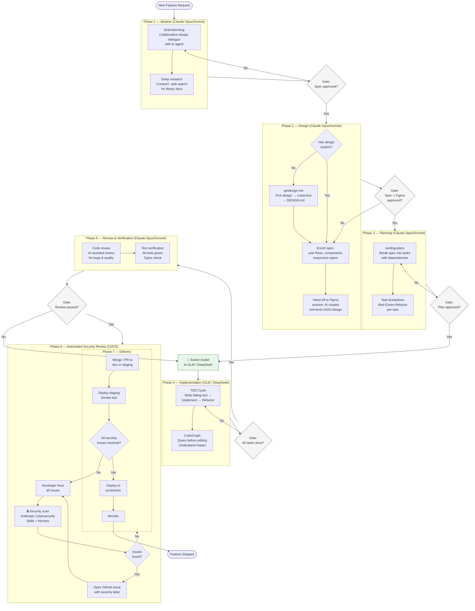
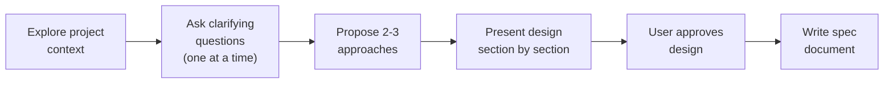
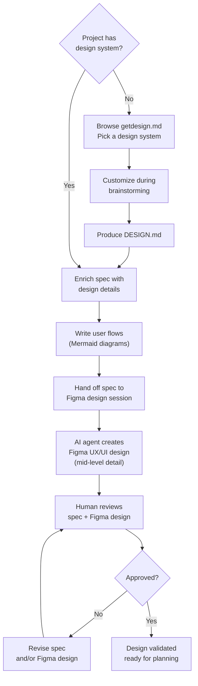
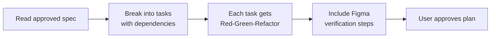
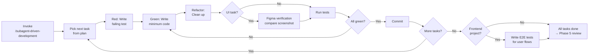
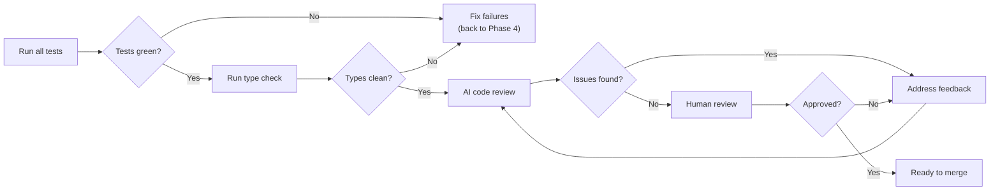
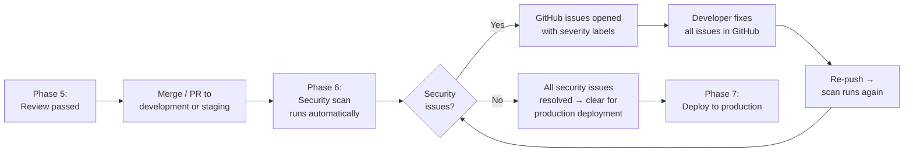
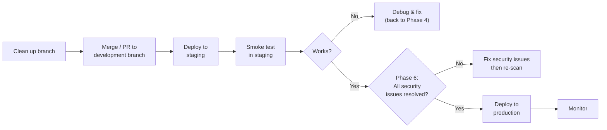
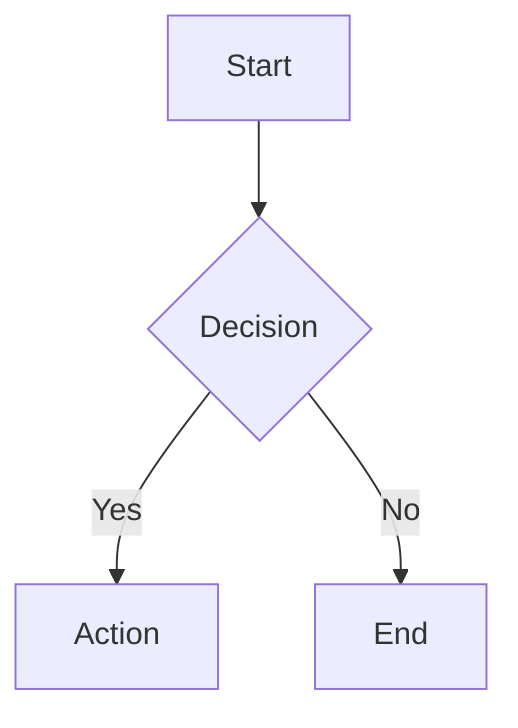

[English](README.md) | [ພາສາລາວ](README.la.md)

# AI Agent Development Workflow — Internal Process Document

**Status:** Updated
**Date:** 2026-06-01
**Owner:** Engineering Team
**Scope:** Organization-wide reference for AI-assisted development

---

<!-- markdownlint-disable MD024 -->

## Table of Contents

1. [Overview & Principles](#1-overview--principles)
2. [Lifecycle Diagram](#2-lifecycle-diagram)
3. [Phase 1 — Ideation](#3-phase-1--ideation)
4. [Phase 2 — Design](#4-phase-2--design)
5. [Phase 3 — Planning](#5-phase-3--planning)
6. [Phase 4 — Implementation](#6-phase-4--implementation)
7. [Phase 5 — Review & Verification](#7-phase-5--review--verification)
8. [Phase 6 — Automated Security Review](#8-phase-6--automated-security-review)
9. [Phase 7 — Delivery](#9-phase-7--delivery)
10. [Tool Reference Catalog](#10-tool-reference-catalog)
11. [Multi-Model Strategy](#11-multi-model-strategy)
12. [Anti-Patterns](#12-anti-patterns)
13. [Appendix A — Xangnam-CF Case Study](#appendix-a--xangnam-cf-case-study)
14. [Appendix B — CLAUDE.md Template](#appendix-b--claudemd-template)

---

## 1. Overview & Principles

### Why This Document Exists

AI coding agents are force multipliers for disciplined engineering — not replacements for thinking. Without structure, AI agents accelerate mistakes as fast as they accelerate progress. This document defines a repeatable workflow that ensures AI amplifies quality rather than velocity alone.

Every feature, regardless of size, goes through the same lifecycle phases. AI agents assist at each phase, but **human judgment gates every transition** between phases.

### Guiding Principles

1. **Design before code.** Never start implementing without an approved spec and plan. An hour of design saves a day of rework.

2. **Verify before claiming done.** Evidence before assertions. Tests pass, types check, design matches — or it isn't done.

3. **One tool per job.** Each AI tool has a strength. Use it for that purpose. Don't ask Figma MCP to write SQL, don't ask CodeGraph to design UI.

4. **Context is king.** Feed the agent the right context before asking it to work. Project instructions (`CLAUDE.md`), design system tokens, existing specs — this is what separates a useful agent from a confused one.

5. **Gates are not suggestions.** The transitions between phases (spec → plan → code → review) are mandatory checkpoints. Skipping a gate invalidates the work that follows.

6. **Trust but verify.** AI output is a draft until a human or automated test confirms it. Every generated function, migration, and UI component must be verified before it ships.

7. **Incremental over big-bang.** Small, verified steps beat large unverified leaps. Commit after each logical unit of work, not after a marathon session.

8. **Right model for the right phase.** Use the strongest reasoning models (Claude Opus/Sonnet) for design, planning, and review — where judgment matters. Use cost-effective coding models (GLM, DeepSeek) for implementation — where the plan is already clear and execution is mechanical. Switch models deliberately at phase boundaries.

---

## 2. Lifecycle Diagram

The following diagram shows the complete feature lifecycle with AI agent touchpoints and human gates.



### At a Glance

| Phase | Model | Input | Output | Gate |
| --- | --- | --- | --- | --- |
| 1 — Ideation | Opus / Sonnet | Feature request | Spec doc | Human approves spec |
| 2 — Design | Opus / Sonnet | Approved spec | `DESIGN.md` + Figma frames | Human approves spec + Figma |
| 3 — Planning | Sonnet / Opus | Approved design | Implementation plan | Human approves plan |
| 4 — Implementation | GLM / DeepSeek | Approved plan | Committed, tested code | All tasks green |
| 5 — Review | Opus / Sonnet | Committed code | Reviewed, type-safe codebase | AI + human review pass |
| 6 — Security | CI/CD (auto) | Every push | GitHub issues or clean scan | All security issues resolved |
| 7 — Delivery | Any | Clean scan + review | Feature in production | — |

---

## 3. Phase 1 — Ideation

**Use for every new feature, component, or significant change — no exceptions.** Turn a raw idea into a validated spec through collaborative dialogue before any code is written. Even "simple" features benefit from this step; unexamined assumptions in small projects cause the most wasted work.

### Workflow



### Steps

1. **Explore project context.** The AI agent reads existing files, docs, recent commits, and project instructions to understand where the new feature fits.

2. **Clarifying questions.** The agent asks one question at a time to understand purpose, audience, constraints, and success criteria. Prefer multiple-choice questions over open-ended ones. The human answers drive scope decisions.

3. **Propose approaches.** The agent presents 2-3 different approaches with trade-offs and a clear recommendation. The human selects or combines approaches.

4. **Present design.** The agent presents the design section by section (architecture, components, data flow, error handling, testing). The human approves or requests changes after each section.

5. **Write spec.** The validated design is saved as a structured markdown document in the project's spec directory.

### Tools Used

| Tool | Role |
| --- | --- |
| Claude Code + Superpowers `/brainstorming` skill | Orchestrates the ideation dialogue |
| Context7 MCP | Fetches current library/framework documentation so designs reference real APIs |
| Web search | Researches best practices, patterns, and competitor approaches |
| CodeGraph | Understands existing codebase structure before proposing changes |

### Decision Points

- **Scope too large?** If the request describes multiple independent subsystems (e.g., "build a platform with chat, file storage, billing, and analytics"), decompose into sub-projects first. Each sub-project gets its own spec → plan → implementation cycle.
- **Scope genuinely small?** The design can be short — a few sentences — but it still goes through the process. No skipping.

### Output

A spec document saved to `docs/superpowers/specs/YYYY-MM-DD-<topic>-design.md` (or the project's equivalent spec directory), committed to git.

---

## 4. Phase 2 — Design

**Use after the spec is approved in Phase 1, before writing an implementation plan.** Turn the spec into a complete design package: an enriched spec with user flows and responsive specifications, plus a mid-level Figma UX/UI design for visual review. **First gate:** if the project has no design system, one must be created before any other design work begins.

### Workflow



### Steps

1. **Design system gate (mandatory first step).** Before any design work begins, check whether the project has a design system document (`design-system.md` or `DESIGN.md`). If it does not:
   - Browse [getdesign.md](https://getdesign.md/) to find a design system that matches the project's brand and aesthetic.
   - Pick a design system as a starting point (e.g., Cal.com for clean/developer-oriented, Stripe for premium/fintech, Linear for ultra-minimal).
   - Customize it during brainstorming — adjust colors, typography, spacing, and component rules to fit the project.
   - Save the customized result as `docs/DESIGN.md` (or `docs/design-system.md`).
   - This file becomes the single source of truth for all design tokens. No UI work proceeds without it.

2. **Enrich spec with design details.** The spec from Phase 1 captures *what* and *why*. Phase 2 fills in the visual and structural details so implementation is unambiguous:
   - **Architecture** — Component tree, page structure, how sections relate
   - **Data flow** — Mermaid diagrams showing how data moves through the feature
   - **Components** — Which design system components to use (Button, Card, Badge, etc.)
   - **Responsive** — Layout at mobile (<768px), tablet (768-1024px), desktop (≥1024px). Grid column counts, typography scaling, CTA stacking, and navigation patterns must all be explicit.

3. **Write user flows.** For every user-facing feature, produce a user flow diagram in Mermaid showing the complete path a user takes through the feature. Include:
   - Entry points (where does the user come from?)
   - Decision points (what choices does the user make?)
   - Happy path and error/empty states
   - Exit points (where does the user go next?)
   - Each screen/state in the flow maps to a Figma frame

4. **Hand off to Figma design session.** Open a **separate AI agent session** (not the brainstorming session) and provide it with:
   - The enriched spec document
   - The user flow diagrams
   - The `DESIGN.md` / design system tokens
   - The Figma file key (create one if needed)
   - Instructions to design each screen from the user flow as a Figma frame

5. **AI agent creates Figma UX/UI design.** The Figma session agent uses Figma MCP (`use_figma`) to create the visual design. The detail level is **mid-level** — structured and specific enough for implementation, but not exhaustively detailed:

   **What the Figma design includes (mid-level detail):**
   - Page layouts with correct spacing, padding, and section structure
   - Real component placement (buttons, cards, forms, navigation) using design system tokens
   - Typography hierarchy (heading sizes, body text, labels) matching `DESIGN.md`
   - Color application using design system variables (primary, accent, surface colors)
   - Responsive variants: mobile and desktop layouts for key screens
   - Interactive state hints (hover, active, disabled — noted but not exhaustive)
   - Empty states, error states, and loading states for key screens

   **What the Figma design does NOT include (out of scope for mid-level):**
   - Micro-interaction animations (hover transitions, scroll effects)
   - Pixel-perfect icon sizing for every possible state
   - Exhaustive variant matrices (e.g., every button × color × size combination)
   - Dark mode variants (unless specifically required)

6. **Human reviews both spec and Figma design.** The approval gate requires reviewing **two artifacts**:
   - **Spec review** — Read the enriched spec document. Check that user flows are complete, responsive specs are explicit, and component choices make sense.
   - **Figma visual review** — Open Figma and walk through the frames. Check that layouts match expectations, spacing feels right, typography is readable, and the overall visual direction is correct.
   - **Both must pass.** If the spec is good but the Figma design is off, revise the Figma. If the Figma looks good but the spec is missing details, go back to the spec.

7. **Post-implementation verification (Phase 4).** After code is written, re-fetch the Figma screenshot and compare against the rendered page. This happens in Phase 4, not here — but the Figma frames created in this phase are the reference for that comparison.

### Tools Used

| Tool | Role |
| --- | --- |
| [getdesign.md](https://getdesign.md/) | Library of production-grade DESIGN.md files. Browse, pick a design system, customize for the project. Required when no design system exists. |
| Figma MCP (`use_figma`) | Creates the UX/UI design programmatically in Figma. Used by the design session agent to build frames from the spec. |
| Figma MCP (`get_design_context`) | Fetches design metadata, code references, and screenshots for a Figma node. Used during review. |
| Figma MCP (`get_screenshot`) | Captures visual state for comparison during post-implementation verification. |
| Design system doc (`DESIGN.md` or `design-system.md`) | The single source of truth for tokens and components. Provided to the Figma design agent. |

### Decision Points

- **No design system exists?** This is a blocking gate. Browse getdesign.md, pick a design, customize it, and produce `DESIGN.md` before proceeding. No exceptions.
- **No Figma file exists yet?** Create one before the Figma design session. The agent needs a file key to write frames into.
- **Design doesn't match tokens?** Either update the Figma design to use tokens, or (rarely) propose a new token. Never bypass the token system.
- **Figma design too low detail?** If frames look like wireframes without real spacing/typography, re-run the Figma design session with more explicit instructions.
- **Figma design too high detail?** If the agent is spending time on micro-interactions or exhaustive variants, scope it back to mid-level. That detail belongs in implementation.

### Output

1. A `DESIGN.md` file (if one didn't exist)
2. An enriched spec with user flow diagrams and responsive specifications
3. A Figma file with mid-level UX/UI designs for all screens in the user flow
4. Human approval of **both** the spec document and the Figma visual design

---

## 5. Phase 3 — Planning

**Use after both the spec and Figma design are approved in Phase 2.** Break the approved spec into an ordered sequence of implementation tasks — each small enough to finish in one sitting, independently verifiable, and following an explicit Red-Green-Refactor cycle.

### Workflow



### Steps

1. **Read the spec.** The AI agent reads the full approved spec document.

2. **Task breakdown.** The agent decomposes the spec into discrete tasks. Each task must be:
   - **Small enough to complete in one sitting** — if a task takes more than a few hours, split it
   - **Independently verifiable** — each task has a clear "done" state
   - **Ordered by dependency** — foundational tasks before dependent tasks

3. **Red-Green-Refactor per task.** Every implementation task includes three explicit sub-steps:
   - **Red** — Write the failing test first. No implementation code until the test exists and fails for the right reason.
   - **Green** — Write the minimum code to make the test pass.
   - **Refactor** — Clean up without breaking the test.

4. **Figma verification steps.** For any task involving UI, include pre-implementation (fetch Figma context) and post-implementation (compare screenshot) steps.

5. **User approval.** Present the plan for human review. No implementation begins until the plan is approved.

### Tools Used

| Tool | Role |
| --- | --- |
| Claude Code + Superpowers `/writing-plans` skill | Structures the plan with phases, tasks, and dependencies |
| CodeGraph | Identifies files and symbols that will be affected, helps estimate impact |
| Task management (TaskCreate/TaskUpdate) | Tracks progress through the plan |

### Decision Points

- **Task has unclear scope?** Split it. Vague tasks lead to vague implementations.
- **Task has no test path?** Red flag. If you can't test it, you can't verify it. Rethink the task.
- **Parallel tasks possible?** Mark independent tasks for parallel execution using subagents or worktrees.

### Output

A plan document saved to `docs/superpowers/plans/YYYY-MM-DD-<topic>-implementation.md` (or the project's equivalent plan directory), committed to git.

---

## 6. Phase 4 — Implementation

**Use after the plan is approved in Phase 3. Switch to GLM or DeepSeek at this phase boundary.** Execute the plan via `/subagent-driven-development`, which dispatches a fresh subagent per task with isolated context. Follow TDD discipline and query CodeGraph before every edit.

### Workflow



### Steps

1. **Invoke `/subagent-driven-development`.** This skill dispatches a fresh subagent per task from the approved plan. Each subagent gets isolated context — the plan task text, relevant files, and tool access — without inheriting session history.

2. **Pick the next task.** Work through tasks in dependency order. Independent tasks can run in parallel via subagents.

3. **Query before editing.** Before modifying any file, use CodeGraph to understand:
   - What calls this function? (`codegraph_callers`)
   - What would break if I changed this? (`codegraph_impact`)
   - Where is this symbol defined? (`codegraph_search`)

4. **TDD cycle.** Follow Red-Green-Refactor for each task:
   - Write the test first. Watch it fail. Understand why it fails.
   - Write the minimum implementation to make it pass.
   - Refactor for clarity, naming, and structure — without breaking the test.

5. **Figma verification (UI tasks).** After implementing UI:
   - Fetch the Figma frame screenshot
   - Compare against the rendered page
   - Fix any deviations in spacing, typography, colors, or layout

6. **Commit.** After each task is green and verified, commit with a descriptive message.

7. **Two-stage review per task.** Subagent-driven-development automatically runs:
   - **Spec compliance review** — did the subagent build what the spec requested?
   - **Code quality review** — is the implementation clean and maintainable?
   - Issues found → subagent fixes → re-review until approved.

8. **E2E tests (frontend projects only — web and mobile apps).** After all component-level tasks are done and their unit tests pass, write end-to-end tests that cover the **full user flows** defined in Phase 2:
   - Each user flow diagram from the spec should have a corresponding E2E test suite
   - Test the happy path: user completes the primary action successfully
   - Test error states: form validation, API errors, empty states
   - Test responsive behavior: at minimum mobile and desktop viewports
   - Run against the actual rendered application (not mocks)
   - These tests validate that all components work together correctly — unit tests can't catch integration failures
   - Treat E2E tests like any other task: Red-Green-Refactor. Write the failing E2E test first, then ensure the feature makes it pass.

### Tools Used

| Tool | Role |
| --- | --- |
| Claude Code + `/subagent-driven-development` | Orchestrates task dispatch, review, and iteration |
| CodeGraph MCP | Pre-edit code intelligence — understand structure before modifying |
| Figma MCP (`get_screenshot`, `get_design_context`) | Post-implementation visual verification |
| Supabase MCP | Database migrations, type generation, auth configuration |
| Context7 MCP | Fetch current API docs for libraries being used |
| Test runner (Vitest, etc.) | Validates Red-Green-Refactor cycle |
| E2E test runner (Playwright, etc.) | Validates full user flows for frontend projects |

### Decision Points

- **Edit feels risky?** Use a git worktree for isolation. Work in a separate branch, verify, then merge.
- **Agent going off-plan?** Stop it. Re-read the plan. The plan is the contract — deviations need explicit approval.
- **Stuck on a bug?** Switch to systematic debugging mode. Describe the symptom, form a hypothesis, test it. Don't shotgun-edit files hoping something works.

### Output

Working code committed incrementally, with each commit representing one verified task from the plan.

---

## 7. Phase 5 — Review & Verification

**Use after all Phase 4 tasks are complete, before merging or deploying. Switch back to Claude Opus/Sonnet.** This is the final whole-feature review — task-level reviews already ran inside Phase 4. Every test must pass and types must be clean before review begins.

### Workflow



### Steps

1. **Run all tests.** Execute the full test suite. Every test must pass. No skipped tests, no flaky passes.

2. **Run type checks.** TypeScript (or equivalent) must compile with zero errors. Type safety is non-negotiable.

3. **AI-assisted code review.** Use the code review skill to scan the full diff for:
   - Correctness bugs
   - Security vulnerabilities
   - Performance issues
   - Adherence to design system and project conventions

4. **Address review feedback.** Treat AI review feedback the same as human review feedback — evaluate each point technically. Don't blindly implement suggestions; understand them first.

5. **Human review.** A team member reviews the changes. The AI review should have already caught mechanical issues, so the human can focus on architecture, business logic, and design intent.

6. **Final visual verification.** For UI changes, do one last Figma comparison to catch any drift introduced during review fixes.

### Tools Used

| Tool | Role |
| --- | --- |
| Claude Code + Superpowers `/code-review` skill | AI-assisted code review |
| Test runner | Validates all tests pass |
| TypeScript compiler | Type safety check |
| ESLint | Code quality and style enforcement |
| Figma MCP | Final visual comparison |

### Decision Points

- **AI review finds a real bug?** Fix it, re-run tests, re-review the fix.
- **AI review suggestion seems wrong?** Don't implement it blindly. Verify independently. If it's truly not an issue, document why you're not addressing it.
- **Human reviewer disagrees with AI?** Human judgment wins. But the human should explain why — "trust me" isn't a review comment.

### Output

A reviewed, tested, type-safe codebase ready for merge.

---

## 8. Phase 6 — Automated Security Review

**Runs automatically on every git push via Hermes + CI/CD — this is not a manual step.** Developers can merge to development and staging after Phase 5 passes. **Production deployment is blocked until all GitHub security issues are resolved.**

### Relationship to Delivery



**Key rule:** Developers can merge to dev/staging after Phase 5. They **cannot** deploy to production until Phase 6 shows a clean scan (all GitHub security issues resolved).

### Steps

1. **Developer pushes code.** When code is pushed to the git repository (GitHub or GitLab), Hermes detects the push event and triggers the security scan pipeline.

2. **Hermes triggers security scan.** Hermes connects the git repository to the security scanning pipeline. It handles:
   - Webhook integration with GitHub/GitLab
   - Triggering scans on push events (all branches) and pull requests (target: main)
   - Passing the diff to the security scanning agent

3. **Security scan runs.** The scanning agent uses [Anthropic Cybersecurity Skills](https://github.com/mukul975/Anthropic-Cybersecurity-Skills) — 754 structured cybersecurity skills across 26 domains mapped to MITRE ATT&CK, NIST CSF 2.0, and more. The scan covers:
   - **Web Application Security** — OWASP Top 10, SQLi, XSS, SSRF, deserialization
   - **API Security** — GraphQL, REST, OWASP API Top 10, WAF bypass
   - **Container Security** — K8s RBAC, image scanning, container misconfigurations
   - **Cloud Security** — AWS/Azure/GCP hardening, CSPM, cloud forensics
   - **Identity & Access Management** — IAM policies, privilege escalation, auth bypass
   - **DevSecOps** — CI/CD security, code signing, infrastructure-as-code auditing
   - **Cryptography** — TLS misconfigurations, weak keys, certificate issues
   - **Secrets detection** — API keys, passwords, tokens in the diff

4. **Issues found → open GitHub issue with severity labels.** If the scan identifies security vulnerabilities, it automatically opens a GitHub issue with:
   - **`security` label** — for filtering and triage
   - **Severity label** — one of `security:critical`, `security:high`, `security:medium`, `security:low`
   - Description of the vulnerability
   - Affected file(s) and line number(s)
   - Recommended remediation from the cybersecurity skills library
   - MITRE ATT&CK technique mapping (where applicable)

5. **Developer fixes all issues before production.** The developer must resolve every open security issue in GitHub before production deployment:
   - **`security:critical`** — Must fix immediately. Active exploitation risk. Production deployment blocked.
   - **`security:high`** — Must fix before production. Significant vulnerability. Production deployment blocked.
   - **`security:medium`** — Should fix before production. Moderate risk. Production deployment blocked until resolved.
   - **`security:low`** — Must acknowledge. Minor risk. Production deployment blocked until resolved or documented as accepted risk.

6. **Re-push triggers re-scan.** After fixing issues, the developer pushes the fix. Hermes triggers a new scan. If clean, the security gate passes.

7. **All issues resolved → production deployment cleared.** Only when all GitHub security issues are closed (fixed or documented as accepted risk) can Phase 7 proceed to production deployment.

### Tools Used

| Tool | Role |
| --- | --- |
| [Anthropic Cybersecurity Skills](https://github.com/mukul975/Anthropic-Cybersecurity-Skills) | 754 structured security skills for AI agents. Covers 26 domains mapped to MITRE ATT&CK, NIST CSF 2.0, MITRE ATLAS, D3FEND, and NIST AI RMF. Install via `npx skills add mukul975/Anthropic-Cybersecurity-Skills`. |
| Hermes | CI/CD integration agent. Connects to GitHub/GitLab, triggers scans on push events, manages pipeline orchestration. |
| GitHub Issues | Automated issue creation with severity labels for vulnerability tracking. |

### Decision Points

- **Security issue found?** Open GitHub issue. Developer fixes in Phase 4, re-pushes, scan re-runs.
- **False positive?** Document why it's not a real issue in the GitHub issue. Close with explanation. Don't disable the scanner.
- **Scan fails to run?** Treat it as a pipeline failure. Don't deploy to production without a security scan result.
- **Team accepts risk?** For `security:low` issues that are genuinely acceptable, document the rationale in the GitHub issue and close with the `security:accepted-risk` label.

### Output

- Security scan report (pass or issues found)
- GitHub issues with severity labels (`security:critical`, `security:high`, `security:medium`, `security:low`) for any vulnerabilities detected
- Production deployment gate: all issues resolved → Phase 7 cleared

---

## 9. Phase 7 — Delivery

**Use after Phase 5 passes (for dev/staging merge) and Phase 6 is clean (for production deployment).** Integrate the completed work into the main branch and deploy with confidence.

### Workflow



### Steps

1. **Clean up the branch.** Rebase on main, resolve any conflicts, ensure the branch history tells a coherent story.

2. **Merge or create PR.** Depending on team workflow:
   - Direct merge for small, well-reviewed changes
   - Pull request for larger features, giving the team visibility

3. **Deploy to staging.** Verify the feature works in a staging environment that mirrors production.

4. **Smoke test.** Run through the critical user paths affected by the change. Verify nothing else broke.

5. **Deploy to production.** With staging verified, promote to production.

6. **Monitor.** Watch error rates, performance metrics, and user feedback for the first hour after deployment.

### Tools Used

| Tool | Role |
| --- | --- |
| Git | Branch management, merge, rebase |
| CI/CD pipeline | Automated deployment |
| Monitoring (Sentry, etc.) | Post-deployment health check |

### Decision Points

- **Staging reveals an issue?** Back to Phase 4. Don't patch in staging and promote — fix properly through the cycle.
- **Production issue?** Rollback first, investigate second. The git history and plan make it easy to trace what changed.

### Output

Feature live in production, monitored, and stable.

---

## 10. Tool Reference Catalog

A quick-reference for every AI tool in the stack. Not a tutorial — just what it does, when to use it, and when not to.

### Claude Code CLI

| Attribute | Detail |
| --- | --- |
| **What** | Primary AI coding agent. Runs in the terminal, reads and writes files, executes commands, manages git. |
| **When to use** | All coding tasks — implementation, debugging, refactoring, writing tests, git operations. |
| **When NOT to use** | Design reviews, visual verification (use Figma MCP instead). Don't use it as a search engine. |
| **Key concept** | CLAUDE.md files provide persistent context. Global (`~/.claude/CLAUDE.md`), project root (`CLAUDE.md`), and `.claude/CLAUDE.md` layer together to give the agent project-specific instructions. |

### Superpowers Plugin

| Attribute | Detail |
| --- | --- |
| **What** | A skill system that enforces development workflow phases through structured prompts. |
| **When to use** | Always. Superpowers skills are triggered by slash commands and lifecycle events. |
| **Key skills** | `/brainstorming` → `/writing-plans` → TDD implementation → `/code-review` → `/verification-before-completion` |
| **Key concept** | Skills are not optional. If a skill applies to your task, you use it. The skill system prevents skipping phases. |

### Figma MCP

| Attribute | Detail |
| --- | --- |
| **What** | Bidirectional bridge between Figma designs and code. Reads design context, screenshots, metadata. Writes designs programmatically. |
| **When to use** | Pre-implementation (read design specs), post-implementation (verify against design), code-to-design sync. |
| **When NOT to use** | Writing business logic. Generating SQL. Anything that isn't visual design. |
| **Key tools** | `get_design_context` (primary — returns code + metadata + screenshot), `get_screenshot` (visual comparison), `use_figma` (programmatic design creation/editing) |

### Claude Code Memory System

| Attribute | Detail |
| --- | --- |
| **What** | Persistent file-based memory that survives across sessions. Stored in `.claude/projects/` directories. |
| **When to use** | When you learn something non-obvious that isn't in the codebase or git history. User preferences, project constraints, gotchas. |
| **When NOT to use** | For things the repo already records (code structure, git history). For temporary conversation context. |
| **Key concept** | Memory files are recalled automatically at session start. Write them sparingly — only facts that would save time on the next conversation. |

### getdesign.md

| Attribute | Detail |
| --- | --- |
| **What** | Library of 70+ production-grade DESIGN.md files analyzing real product design systems (tokens, patterns, rules). Designed to give AI coding agents precise design rules. |
| **When to use** | When a project has no design system. Browse the library, pick a design system that fits the project's brand, customize it during brainstorming, and save as `docs/DESIGN.md`. |
| **When NOT to use** | When the project already has a design system. When the project has no UI. |
| **Key concept** | Each DESIGN.md encodes real design decisions — colors, typography, spacing, components — as structured rules an AI agent can follow. It replaces ad-hoc styling with a system. Available at [getdesign.md](https://getdesign.md/). |

### Anthropic Cybersecurity Skills

| Attribute | Detail |
| --- | --- |
| **What** | 754 structured cybersecurity skills for AI agents, covering 26 security domains. Mapped to MITRE ATT&CK, NIST CSF 2.0, MITRE ATLAS, D3FEND, and NIST AI RMF. Open-source (Apache 2.0). |
| **When to use** | Automated security scanning in CI/CD (Phase 6). Scans code diffs for vulnerabilities across web app security, API security, container security, cloud security, IAM, cryptography, and secrets detection. |
| **When NOT to use** | Manual code review (use `/code-review` instead). Design or planning phases. |
| **Key concept** | Each skill costs ~30 tokens to scan (frontmatter) and 500–2,000 tokens to fully load. Agents can search all 754 skills in a single pass. Install via `npx skills add mukul975/Anthropic-Cybersecurity-Skills`. Available at [GitHub](https://github.com/mukul975/Anthropic-Cybersecurity-Skills). |

### Hermes / Multica with Autopilot

| Attribute | Detail |
| --- | --- |
| **What** | CI/CD integration layer that connects git repositories (GitHub, GitLab) to automated security scanning pipelines. **Hermes** handles webhook integration and pipeline orchestration. **Multica with Autopilot** is an alternative: a multi-agent Claude Code setup that runs the security scan autonomously on each push via scheduled Autopilot agents. |
| **When to use** | Phase 6 — connects the git repo to the security scan pipeline. Use Hermes for traditional webhook-driven CI/CD. Use Multica with Autopilot when you want Claude Code agents to orchestrate the scan directly without a separate CI/CD server. |
| **When NOT to use** | Manual security review. Local development scanning. |
| **Key concept** | Both options bridge "code was pushed" → "security scan runs." Hermes is the conventional pipeline approach; Multica with Autopilot leverages Claude Code's multi-agent scheduling to run the same Anthropic Cybersecurity Skills scan without external CI/CD infrastructure. |

---

## 11. Multi-Model Strategy

### Why Multiple Models

Not all phases require the same level of reasoning. Design, planning, and review demand strong judgment — understanding trade-offs, evaluating architectures, catching subtle bugs. Implementation is different: the plan already specifies what to build, so the work is mechanical execution against a clear specification.

Using a cost-effective model for implementation reduces cost significantly while maintaining quality, because the plan (written by a stronger model) already made the hard decisions.

### Model Routing Table

| Phase | Model | Why |
| --- | --- | --- |
| Phase 1 — Ideation | **Claude Opus** (preferred) or **Claude Sonnet** | Brainstorming requires judgment, creativity, and the ability to ask the right clarifying questions |
| Phase 2 — Design | **Claude Opus** (preferred) or **Claude Sonnet** | Design system creation and Figma design session require attention to detail and visual reasoning |
| Phase 3 — Planning | **Claude Sonnet** (preferred) or **Claude Opus** | Task decomposition is structured work — Sonnet handles it well at lower cost |
| Phase 4 — Implementation | **GLM** or **DeepSeek** (developer's choice) | Plan is clear, execution is mechanical. Cost-effective models excel here with the plan as context |
| Phase 5 — Review | **Claude Opus** (preferred) or **Claude Sonnet** | Code review requires catching subtle bugs, security issues, and design drift — judgment matters |
| Phase 6 — Delivery | Any model | Git operations and deployment are straightforward. Use whichever model is currently active |

### Switching Protocol

The developer switches models **deliberately at phase boundaries** — not mid-task.

```
Phase 1 (Claude) → Phase 2 (Claude) → Phase 3 (Claude) → 🔄 Switch → Phase 4 (GLM/DeepSeek via /subagent-driven-development) → Phase 5 (Claude) → Phase 6 (any)
```

**Before switching TO implementation model (Phase 3 → Phase 4):**
1. Ensure the plan is complete and committed
2. Ensure `CLAUDE.md`, `DESIGN.md`, and the plan file are accessible
3. Note the current git commit SHA (for the implementation agent to branch from)

**After implementation completes (Phase 4 → Phase 5):**
1. The subagent-driven-development skill runs two-stage review per task automatically
2. Return to the main Claude session for the final whole-feature review
3. Note the current git commit SHA (for review diff)

### Context Handoff Between Models

When switching models, the new model needs context from the previous phase. Provide:

| Switching to... | Provide this context |
| --- | --- |
| GLM/DeepSeek (implementation) | The plan file, `CLAUDE.md`, `DESIGN.md`, and the git branch to work on |
| Claude Opus/Sonnet (review) | The plan file, the full git diff (base SHA → current SHA), and `DESIGN.md` |

### Decision Points

- **Implementation model struggling?** Switch back to Claude Sonnet for the difficult task, then return to GLM/DeepSeek for the remaining tasks. Don't force a model that's not coping.
- **Not sure which implementation model to use?** Try GLM first. If results are poor, try DeepSeek. Pick the one that produces better output for your codebase.
- **Small project where switching isn't worth it?** Use Claude Sonnet end-to-end. The switching overhead isn't justified for a 30-minute task.

---

## 12. Anti-Patterns

Patterns that indicate the workflow is being bypassed or misused. If you recognize any of these, stop and correct course.

| Anti-Pattern | Why It's Dangerous | What to Do Instead |
| --- | --- | --- |
| **"This is too simple for the process"** | Simple projects are where unexamined assumptions cause the most wasted work. | Run the process. The design can be short, but it must exist. |
| **Skipping brainstorming** | You build the wrong thing fast. | Always brainstorm first. Even a 5-minute ideation dialogue catches bad assumptions. |
| **Coding without a plan** | Work becomes chaotic, incomplete, or duplicated. | Write the plan. Approve it. Then code. |
| **Skipping the failing test** | You don't know if your implementation actually satisfies the requirement. | Write the test first. Watch it fail. Then implement. |
| **Ignoring CodeGraph before edits** | You break things you didn't know were connected. | Query before editing. Every time. |
| **Hardcoding values instead of using design tokens** | The UI drifts from the design system and becomes inconsistent. | Always use tokens. If a token doesn't exist, create one. |
| **Blindly accepting AI review suggestions** | AI can be confidently wrong. Implementing without understanding creates new bugs. | Evaluate each suggestion. Verify independently. Reject if wrong. |
| **Skipping Figma verification** | The implementation looks "close enough" but accumulates visual drift. | Compare screenshots after every UI task. Fix deviations immediately. |
| **Big-bang commits** | Hard to review, hard to revert, hard to debug. | Commit after each verified task. Small, descriptive commits. |
| **Using the wrong tool for the job** | Each tool has a strength. Misusing it wastes time and produces poor results. | Check the Tool Reference Catalog. Use the right tool. |
| **Starting UI work without a design system** | Every component becomes a one-off decision. Inconsistency compounds. | Create `DESIGN.md` first. Browse getdesign.md, pick a system, customize. |
| **Using an expensive model for mechanical implementation** | Wasting budget on reasoning that isn't needed. The plan already made the decisions. | Switch to GLM/DeepSeek for Phase 4. Switch back for review. |
| **Forcing a model that's struggling** | The implementation model can't handle a complex task. Continuing produces bad code. | Switch back to Claude for the difficult task. Return to the cost-effective model after. |
| **Skipping the security scan** | Vulnerabilities ship to production undetected. | Let Phase 6 run on every push. Fix issues before merging. Never disable the scanner. |
| **Ignoring security issues as "false positives"** | Real vulnerabilities get dismissed without investigation. | Verify each finding. If truly a false positive, document why and close with explanation. |

---

## Appendix A — Xangnam-CF Case Study

This appendix shows how the AI Agent Workflow plays out in practice, using the Xangnam-CF project as a real example. Xangnam-CF is a live commerce SaaS platform for Lao merchants, built with Next.js 15 and Supabase.

### Project Overview

| Attribute | Detail |
| --- | --- |
| **Product** | Live commerce SaaS for Lao merchants |
| **Tech stack** | Next.js 15, Supabase, Tailwind CSS, Figma |
| **Architecture** | Multi-tenant monorepo with sub-projects A–K |
| **AI stack** | Claude Code + Superpowers, CodeGraph, Figma MCP, Supabase Plugin, Context7 |
| **Design system** | Cal.com-inspired, defined in `docs/design-system.md`, implemented in Tailwind tokens |

### How Each Phase Played Out

#### Phase 1 — Ideation in Practice

The project was decomposed into sub-projects (A through K), each with its own spec. Representative examples:

- **Spec A (SaaS Shell):** Resolved authentication flow, multi-tenancy model, and dashboard layout. Key decision: Supabase Auth with row-level security for tenant isolation.
- **Spec B (Product Catalog):** Resolved whether products belong to tenants or merchants, how categories work, and the comment ingestion pipeline. Produced a 60KB spec with 9 detailed sections.
- **Landing Page:** Settled on a Cal.com-inspired design system, dark hero section, and three-tier pricing model.

Nine specs were produced in total, each committed to `docs/superpowers/specs/`.

#### Phase 2 — Design Verification in Practice

The project uses a single Figma file (`PDvqQ9CZNtIX9wvhtZEarw`) with dedicated pages per spec. Before implementing any UI, the agent fetched each Figma frame to extract exact spacing, typography scales, color tokens, and component structure. Post-implementation screenshots caught real deviations — badge background using wrong shade (fixed: lavender bg with violet text), missing optional chaining causing TypeError — that would have accumulated invisibly without the comparison step.

#### Phase 3 — Planning in Practice

Nine plans were produced (one per spec), committed to `docs/superpowers/plans/`. Each plan followed Red-Green-Refactor. For example, the landing page plan broke into tasks for hero, features, pricing, FAQ, and full-page integration — each with explicit Figma verification steps.

#### Phase 4 — Implementation in Practice

CodeGraph prevented cascade failures at every major edit:

- `codegraph_impact` before adding tenant middleware — confirmed what depended on the middleware chain
- `codegraph_trace` before modifying auth flows — followed the full redirect path to understand where `NEXT_REDIRECT` errors originated
- `codegraph_context` before adding product schema — surfaced existing Supabase migration patterns

Each task was committed individually after tests passed — not as a bulk dump.

#### Phase 5 — Review in Practice

Code review caught real issues before they shipped: TypeScript tuple assertion errors in landing page array access, missing optional chaining in `requireTenant` causing TypeError when session was null, and ESLint violations across multiple files. All were fixed before merge.

#### Phase 7 — Delivery in Practice

Git worktrees isolated each feature's work. Each branch merged to main after review. Landing page, pricing page, and how-it-works page shipped as independent, verified deliverables.

### Key Metrics

| Metric | Value |
| --- | --- |
| Specs produced | 9 |
| Plans produced | 9 |
| Commits with verified fixes | 15+ |
| Figma frames verified against | 34+ |
| Design system tokens enforced | 100% (no hardcoded hex values) |

### Lessons Learned

1. **Decomposition pays off.** Breaking the project into sub-projects A–K kept each spec focused and implementable. A monolithic spec would have been unmanageable.

2. **Figma verification catches drift early.** Multiple deviations were caught post-implementation (badge colors, spacing, typography) that would have accumulated invisibly without the screenshot comparison step.

3. **CodeGraph prevents cascade failures.** Querying impact before editing prevented at least two instances of breaking dependent code that grep wouldn't have caught (dynamic dispatch, middleware chains).

4. **TDD discipline compounds.** Each test written first created a safety net that made refactoring safe. When auth flow was restructured, existing tests caught regressions immediately.

5. **CLAUDE.md as persistent context is critical.** The layered instruction system (global → project → `.claude/`) means the AI agent starts every session with the right constraints already loaded. Without this, every conversation would spend 20% of its tokens re-establishing context.

---

*Document generated as part of the Xangnam-CF project. Adapt this framework to your organization's tools and conventions.*

---

## Appendix B — CLAUDE.md Template

This template encodes the AI Agent Workflow into a persistent context file. Place it at `~/.claude/CLAUDE.md` — it applies to all projects on the developer's machine and is read by Claude Code at the start of every session.

### `~/.claude/CLAUDE.md`

````markdown
# [Your Name] — Development Instructions

## Overview

[One paragraph: who you are, what you build, key technologies.]

## Design system (MANDATORY)

Every UI project MUST have a design system before any UI code is written.

- If the project has no design system: browse https://getdesign.md/ → pick a design → customize → save as `docs/DESIGN.md`
- This project has ONE design system: **`docs/design-system.md`**
- Before writing any spec, plan, or UI — for ANY sub-project — you MUST read `docs/design-system.md` and express every UI decision in its tokens and components
- Use design tokens via Tailwind utilities (`bg-primary`, `text-display-xl`, `rounded-lg`, `p-section`, etc.). **Never inline hex values.**
- Primary CTAs are `bg-primary` — never blue or pastel
- Display headlines use `font-display` (Inter @600); body uses `font-sans` (Inter 400). Never blur the boundary
- No hover styling beyond documented press/active state
- Alternate surface modes between consecutive bands (white → light-gray → white → …)
- No card radius beyond `rounded-xl` (16px)
- Reusable primitives live in `apps/web/src/components/ui/` — prefer them over hand-rolled markup

## Flows and Diagrams (MANDATORY)

Any flow documented in a spec, plan, or doc — data flow, user journey, state machine, auth flow, process flow, sequence diagram, architecture overview — **must be written in Mermaid syntax.** No ASCII art, no prose-only descriptions of flows.



## Professional-grade implementation (MANDATORY)

Before starting any implementation task:

1. **Invoke `find-skills`** — use the `Skill` tool with `find-skills` to discover the most relevant superpowers skill before doing any work.

### Spec Requirements for Web and Mobile (MANDATORY)

When writing a spec for any feature that involves **web app or mobile app UI**:

1. **Figma UX/UI design (mid-level detail).** The spec MUST include a Figma UX/UI design section or produce Figma frames at mid-level detail:
   - Page layouts with correct spacing, padding, and section structure
   - Real component placement (buttons, cards, forms, navigation) using design system tokens
   - Typography hierarchy (heading sizes, body text, labels) matching `DESIGN.md`
   - Color application using design system variables
   - Responsive variants: mobile and desktop layouts for key screens
   - Empty states, error states, and loading states for key screens
   - A separate AI agent session uses Figma MCP (`use_figma`) to create the designs
   - Human must review and approve the Figma design before planning

2. **E2E test coverage.** The spec MUST include end-to-end test requirements:
   - Each user flow in the spec must have a corresponding E2E test suite
   - Cover: happy path, error states, form validation, API errors, empty states
   - Cover: responsive behavior (at minimum mobile and desktop viewports)
   - Use the project's E2E test runner (Playwright, etc.)
   - E2E tests are written in Phase 4 after all component tasks are done

### Responsive Design (MANDATORY for all specs and plans)

Every spec and implementation plan for any page or UI component **must** include explicit responsive design specifications at all breakpoints:

| Name | Width | Notes |
|------|-------|-------|
| Mobile | < 768px | Primary design target — always spec mobile first |
| Tablet | 768–1024px | Transitional layout |
| Desktop | ≥ 1024px | Full layout as designed |
| Wide | > 1440px | Content caps at 1200px, no layout changes |

## Tools

- **Design creation:** Figma MCP (separate session for creating UX/UI designs)
- **Design verification:** Figma MCP (pre and post implementation)
- **Design system creation:** https://getdesign.md/ (when no design system exists)

## File Structure

- Specs: `docs/superpowers/specs/YYYY-MM-DD-<topic>-design.md`
- Plans: `docs/superpowers/plans/YYYY-MM-DD-<topic>-implementation.md`
- Design system: `docs/DESIGN.md` (or `docs/design-system.md`)
````
